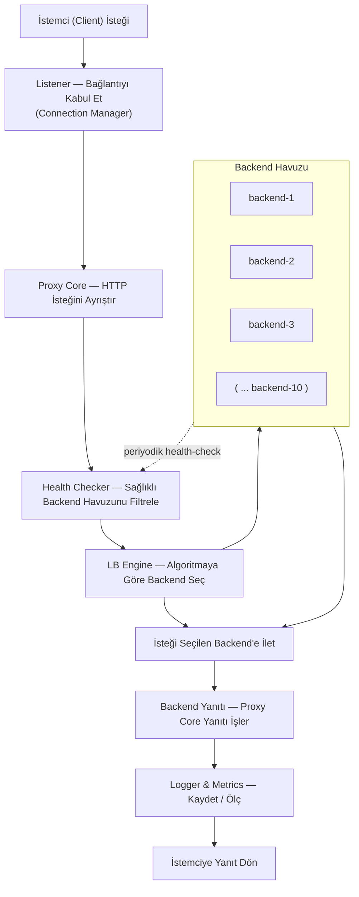
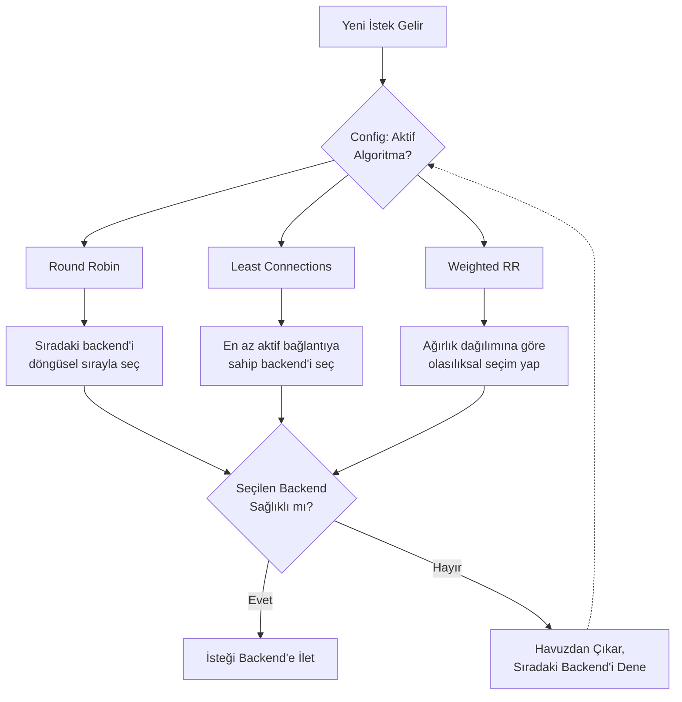
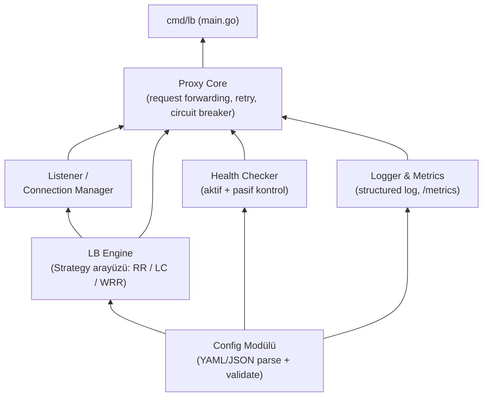

# Go Tabanlı Yüksek Performanslı Reverse Proxy & Yük Dengeleyici

**Teknik Tasarım ve Uygulama Planı**

| | |
| --- | --- |
| Yazar | Berk Egemen Oğuz |
| Hazırlanma tarihi | 31 Ağustos 2026 |
| Sürüm | 1.1 (içerikte v1.6 olarak anılır) |

> Bu dosya, uygulama başlamadan önce yazılan özgün PDF belgesinin Markdown'a aktarılmış
> halidir. Metin değiştirilmemiştir; şekiller aynı içerikle diyagram olarak yeniden çizilmiş,
> Gantt şeması tabloya dönüştürülmüştür. Uygulama sonrası güncellemeler için
> [v1.7 revizyon notlarına](revision-notes-v1.7-tr.md), güncel belge için
> [v1.8'e](technical-design-v1.8-tr.md) bakın.

## İçindekiler

1. [Giriş ve Proje Özeti](#1-giriş-ve-proje-özeti)
2. [Hedefler ve Kapsam](#2-hedefler-ve-kapsam)
3. [Mimari Genel Bakış](#3-mimari-genel-bakış)
4. [I/O Yaklaşımı — Hibrit Model](#4-io-yaklaşımı--hibrit-model)
5. [Yük Dengeleme Algoritmaları](#5-yük-dengeleme-algoritmaları)
6. [Modüler Yapı ve Bağımlılıklar](#6-modüler-yapı-ve-bağımlılıklar)
7. [Versiyon Kontrolü ve Geliştirme İş Akışı](#7-versiyon-kontrolü-ve-geliştirme-iş-akışı)
8. [Test Ortamı — 10 Mock Backend](#8-test-ortamı--10-mock-backend)
9. [12 Günlük Uygulama Planı](#9-12-günlük-uygulama-planı)
10. [Test Stratejisi](#10-test-stratejisi)
11. [Prod Hazırlık Kriterleri (Definition of Done)](#11-prod-hazırlık-kriterleri-definition-of-done)
12. [Riskler ve Azaltma Stratejileri](#12-riskler-ve-azaltma-stratejileri)
13. [Kaynakça](#13-kaynakça)
14. [Sonuç ve Sonraki Adımlar](#14-sonuç-ve-sonraki-adımlar)

---

## 1. Giriş ve Proje Özeti

Bu belge, nginx'e benzer şekilde çalışan; HTTP trafiğini karşılayan, birden fazla backend arasında
dağıtan ve ters proxy (reverse proxy) olarak görev yapan bir yük dengeleyicinin (load balancer)
teknik tasarımını ve 12 günlük uçtan uca uygulama planını tanımlar.

Proje Go dilinde geliştirilecek; modüler bir mimariye sahip olacak (tek parça / monolith bir yapı
yerine, her biri net bir sorumluluğa sahip ve arayüzler üzerinden haberleşen bağımsız modüller),
ve 12 günün sonunda gerçek trafiği kaldırabilecek, üretime (production) dağıtılabilir bir sürüm
hedeflenmektedir.

Belge, sadece bir görev listesi değil; her teknik kararın gerekçesini de açıklayan bir tasarım
referansı olarak kullanılmak üzere hazırlanmıştır. Bölüm 3-6 mimariyi ve tasarım kararlarını,
Bölüm 7 geliştirme sürecinin nasıl yönetileceğini (Git/GitHub), Bölüm 8-9 test ortamını ve gün gün
uygulama takvimini, Bölüm 10-12 kalite ve risk boyutunu ele alır.

- **Neden Go:** Geliştiricinin mevcut Go tecrübesi, düşük giriş maliyeti sağlıyor; ayrıca Go'nun
  runtime'ı (netpoller) yüksek eşzamanlılığı idiomatic biçimde yönetebiliyor.
- **Neden hibrit I/O yaklaşımı:** Üst seviye mimari (yönlendirme, algoritmalar, health check)
  Go'nun standart net paketiyle inşa edilirken, event-loop/epoll mekanizmasının nasıl çalıştığı
  ayrı, opsiyonel bir öğrenme modülünde deneyimlenecek.
- **Neden modüler tasarım:** Config, LB Engine, Health Checker, Proxy Core ve Logger/Metrics
  birbirinden bağımsız geliştirilebilir, test edilebilir ve ilerde yeniden kullanılabilir olacak
  şekilde ayrıştırılmıştır.
- **Neden Git/GitHub:** Geliştirme sürecinin her adımı versiyonlanabilir, geri alınabilir ve
  (ekip büyürse) paralel çalışmaya açık olacak şekilde kayıt altına alınır (bkz. Bölüm 7).
- **Neden çoklu hata stratejisi:** Tek bir sabit davranış yerine seçilebilir stratejiler
  (retry_next_backend / fail_fast / circuit_breaker) sunmak, sistemin farklı senaryolara (düşük
  gecikme öncelikli vs. yüksek toleranslı) config değişikliğiyle uyum sağlamasını mümkün kılar
  (bkz. Bölüm 5.5).
- **Neden temel güvenlik önlemleri:** Ağır bir güvenlik katmanı kurmak yerine; rate limiting,
  kaynak limitleri ve bağımlılık taraması gibi düşük maliyetli, yüksek etkili önlemlerle
  başlamak, 12 günlük kapsamı zorlamadan makul bir güvenlik tabanı sağlar (bkz. Bölüm 6.3).

## 2. Hedefler ve Kapsam

### 2.1 Fonksiyonel Hedefler

- Gelen HTTP isteklerini birden fazla backend sunucusu arasında dağıtan bir ters proxy / yük
  dengeleyici.
- Üç farklı yük dengeleme algoritması: Round Robin, Least Connections, Weighted Round Robin —
  config üzerinden seçilebilir.
- Aktif ve pasif health check ile sağlıksız backend'lerin otomatik olarak devre dışı bırakılması
  ve geri eklenmesi.
- Graceful shutdown, config hot-reload, temel circuit breaker ve retry mekanizması.
- Structured logging ve Prometheus uyumlu metrics endpoint'i ile gözlemlenebilirlik
  (observability).

### 2.2 Kapsam Dışı (İlk Sürüm İçin)

- TLS/SSL sonlandırma (termination) — v1.0 sonrası için planlanabilir.
- HTTP/2 ve gRPC desteği — ayrı bir sonraki faz konusu.
- Çoklu makineden dağıtık (distributed) yük dengeleme / servis keşfi (service discovery)
  entegrasyonu.
- Manuel epoll event-loop implementasyonu ana teslim kapsamının dışında, opsiyonel bir öğrenme
  egzersizi olarak ele alınır (bkz. Bölüm 4).
- **Session affinity (sticky session)** — Backend'ler stateless olacak şekilde tasarlanmıştır
  (mock backend'ler zaten durumsuzdur); istemcinin her seferinde aynı backend'e yönlendirilmesini
  gerektiren bir senaryo hedeflenmemektedir. Bu aynı zamanda simülasyon ortamında ekstra durum
  (state) yönetimi getirmeyerek makine üzerindeki yükü de düşük tutar.

### 2.3 Hedef Kullanım Senaryosu

Sistem; geliştirme (local/dev) ortamlarında ve tek makine üzerinde, birden fazla backend
süreci/örneği arasında trafiği dağıtan küçük-orta ölçekli bir yük dengeleyici olarak kullanılmak
üzere tasarlanmıştır. Çok bölgeli (multi-region), yüzbinlerce eşzamanlı bağlantı hedefleyen büyük
ölçekli senaryolar bu ilk sürümün kapsamı dışındadır; ancak modüler mimari, ilerde bu yönde
genişletilmeye elverişlidir.

Deployment hedefi: Bu ilk sürümde sistem yalnızca yerel makinede, Docker/docker-compose üzerinde
çalıştırılacak; gerçek bir bulut sunucusuna veya production internetine dağıtım yapılmayacaktır.
Bölüm 11'deki "prod hazırlık" kriterleri, gerçek bir sunucuya taşınmaya hazır (Docker image,
health check, graceful shutdown vb.) bir kaliteyi ifade eder — fiili dağıtım bu kapsamın
dışındadır; ücretsiz bir bulut sunucusuna (örn. Oracle Cloud Free Tier) gerçek deployment, v1.0
sonrası için değerlendirilebilir (bkz. Bölüm 14.1).

## 3. Mimari Genel Bakış

Sistem, bir isteğin istemciden backend'e ve geri dönüş yaptığı uçtan uca bir hat üzerinde
tasarlanmıştır. Aşağıdaki akış şeması, bir HTTP isteğinin sistem içinde izlediği yolu
göstermektedir: bağlantının kabul edilmesinden, sağlıklı backend havuzunun filtrelenmesine,
algoritmaya göre backend seçimine ve nihayetinde yanıtın istemciye geri dönmesine kadar.



*Şekil 1 — İstek Yaşam Döngüsü: Ters Proxy / Yük Dengeleyici Mimarisi*

Bu akıştaki her kutu, Bölüm 6'da detaylandırılan ayrı bir Go modülüne karşılık gelir. Modüller
arası iletişim doğrudan çağrı yerine tanımlı arayüzler (interface) üzerinden yürütülür; bu sayede
her modül bağımsız olarak test edilebilir ve ilerde değiştirilebilir (örneğin farklı bir
health-check stratejisi eklemek, Proxy Core'u değiştirmeyi gerektirmez).

### 3.1 Klasör ve Paket Yapısı

Modüler ayrım, Go paket yapısına doğrudan yansıtılır. Her internal/ paketi tek bir sorumluluğa
sahiptir ve dışarıya yalnızca ihtiyaç duyulan arayüzü/tipi export eder:

```
loadbalancer/
├── cmd/
│   └── lb/                    # main.go — giriş noktası, modülleri "wire" eder
├── internal/
│   ├── config/                # YAML/JSON parse + validate
│   ├── balancer/              # LBStrategy arayüzü + RR / LC / WRR
│   ├── health/                # aktif + pasif health check
│   ├── proxy/                 # Proxy Core: forward, retry, circuit breaker
│   ├── server/                # Listener / Connection Manager
│   └── observability/         # structured logger + Prometheus metrics
├── deploy/
│   └── docker-compose.yml     # 10 mock backend + load balancer
├── configs/
│   └── lb.example.yaml
├── go.mod
└── README.md
```

Proje, güncel ve desteklenen bir Go sürümüyle geliştirilecektir: Go 1.27 veya üzeri (go.mod içinde
"go 1.27" olarak sabitlenir). Go yalnızca en güncel iki majör sürümü resmi olarak destekler; bu
nedenle sürüm CI pipeline'ında (bkz. Bölüm 7.3) düzenli olarak kontrol edilip gerektiğinde
güncellenecektir.

### 3.2 Eşzamanlılık Modeli

Bağlantı başına bir goroutine modeli (goroutine-per-connection) kullanılır: her gelen bağlantı
kendi goroutine'inde işlenir, kod senkron biçimde yazılır ama Go runtime'ının netpoller'ı arka
planda alt seviye I/O çoklamayı (Linux'ta epoll üzerinden) yönetir. Paylaşılan durum — aktif
bağlantı sayaçları, round-robin indeksi, backend sağlık durumu — mutex veya atomic tiplerle
korunur (bkz. Bölüm 5.4).

### 3.3 Config Dosyası Şeması

Aşağıdaki örnek, configs/lb.example.yaml dosyasının tam şemasını göstermektedir. Buradaki sayısal
değerler (timeout, limit, eşik) elimizde henüz gerçek yük testi verisi olmadığı için başlangıç
noktası olarak önerilmiştir; 10. gün yük testi sonuçlarına göre (bkz. Bölüm 10.3) revize edilmesi
beklenmektedir.

```yaml
listen_addr: ":8080"
algorithm: round_robin        # round_robin | least_connections | weighted_round_robin
failure_policy: retry_next_backend   # bkz. Bölüm 5.5
retry_on_5xx: false                  # bkz. Bölüm 5.5

retry:
  max_retries: 2

circuit_breaker:
  failure_threshold: 5
  open_duration: 30s

backends:
  - addr: "backend-1:5678"
    weight: 1
  - addr: "backend-2:5678"
    weight: 1

health_check:
  path: "/healthz"
  interval: 5s
  timeout: 2s
  healthy_threshold: 2
  unhealthy_threshold: 3

timeouts:
  connect_timeout: 2s
  read_timeout: 10s
  write_timeout: 10s
  idle_timeout: 60s

limits:
  max_connections: 10000
  max_request_body_bytes: 10485760    # 10 MB
  rate_limit_per_ip: 100              # istek/saniye, bkz. Bölüm 6.3

logging:
  level: info
  format: json
```

- **Timeout değerleri** — connect_timeout kısa tutulur (backend'e ulaşılamıyorsa hızlı vazgeçmek
  için); read/write_timeout tipik bir HTTP isteği için yeterli pay bırakacak şekilde 10 saniye
  önerilir; idle_timeout kullanılmayan bağlantıları belirli bir süre sonra kapatarak kaynak
  israfını önler.
- **Limit değerleri** — max_connections ve rate_limit_per_ip, sunucunun aşırı yüklenmesini (hem
  art niyetli hem kazara) önlemek için başlangıç değerleridir; gerçek trafik gözlemlendikçe
  ayarlanmalıdır (bkz. Bölüm 6.3).
- **Hata yönetimi değerleri** — retry.max_retries, circuit_breaker.failure_threshold ve
  open_duration, Bölüm 5.5'te tanımlanan stratejilerin somut karşılıklarıdır; bu değerler de
  başlangıç noktası olup gerçek hata oranları gözlemlendikçe ayarlanabilir.

## 4. I/O Yaklaşımı — Hibrit Model

Go'da yüksek eşzamanlılık için iki temel yol vardır: (a) standart net paketini kullanarak Go
runtime'ının netpoller'ının epoll/kqueue yönetimini üstlenmesine izin vermek, ya da (b)
x/sys/unix ile epoll'u elle yönetmek. Bu proje için hibrit bir yaklaşım benimsenmiştir.

### 4.1 Faz 1 — Ana Geliştirme (12 Günlük Plan)

Alt seviye I/O yönetimi tamamen Go'nun net paketine ve runtime netpoller'ına bırakılır.
Geliştirme çabası, nginx'i nginx yapan asıl mimari kararlara odaklanır: yönlendirme mantığı, yük
dengeleme algoritmaları, health check stratejisi, connection pooling, graceful shutdown ve circuit
breaker. Bu yaklaşım hem idiomatic Go koduna hem de production'a yakın, gerçekten kullanılabilir
bir sisteme ulaşmayı sağlar.

Go runtime'ı, M:N zamanlama modeliyle (M işletim sistemi thread'i, N goroutine) çalışır;
GOMAXPROCS ile sınırlı sayıda OS thread'i, on binlerce goroutine'i verimli şekilde
çalıştırabilir. Hedef ortam Docker container'ları olduğundan (container içi işletim sistemi her
zaman Linux'tur, bkz. Bölüm 2.3), netpoller pratikte epoll syscall'ını kullanır — yani Faz 1'de
yazılan kod, alt seviyede zaten epoll üzerinde çalışır; sadece bu detay geliştiriciden
soyutlanmıştır.

- **Faz 1'in somut çıktıları:** Config, LB Engine (3 algoritma), Health Checker, Proxy Core,
  Listener, Logger/Metrics — tamamı net paketi üzerine inşa edilmiş, production'a dağıtılabilir
  tam bir sistem.

### 4.2 Faz 2 — Opsiyonel Öğrenme Modülü (Epoll Deneyi)

Ana teslim planını bloklamayan, ayrı bir branch üzerinde yürütülen küçük bir egzersizdir:
x/sys/unix ile minimal, tek dosyalık bir epoll event-loop / echo server yazılır. Amacı production
koduna girmek değil, Go runtime'ının perde arkasında ne yaptığını doğrudan deneyimlemektir. Bu
modül Gantt şemasında 10-11. günlere paralel, opsiyonel bir iz (track) olarak yer alır ve ana 12
günlük teslim tarihini etkilemez.

- **Faz 2'nin somut çıktısı:** experiment/epoll-loop branch'inde, epoll_create1 / epoll_ctl /
  epoll_wait syscall'larını doğrudan kullanan, bağımsız ve küçük bir demo program; ana codebase'e
  merge edilmesi zorunlu değildir.

**Neden bu sıralama:** Epoll deneyi, net paketinin çözdüğü problemi zaten yaşamış birine çok daha
anlamlı gelir. Faz 1 tamamlanmadan Faz 2'ye girmek, hem mimari hem syscall detaylarını aynı anda
çözmeye çalışmak anlamına gelir ve motivasyon kaybı riski taşır.

## 5. Yük Dengeleme Algoritmaları

Üç algoritma da bir ortak LBStrategy arayüzü üzerinden implemente edilir; hangisinin aktif olacağı
config dosyasından seçilir. Bu tasarım, ilerde yeni bir algoritma eklemenin (örn. IP-hash, en az
yanıt süresi) mevcut kodu değiştirmeden mümkün olmasını sağlar.



*Şekil 2 — Yük Dengeleme Algoritması Karar Akışı*

### 5.1 Round Robin

Backend'ler arasında döngüsel sırayla, eşit dağılımla seçim yapar. Uygulaması en basit ve en
öngörülebilir algoritmadır; backend'lerin kapasitesi birbirine yakınsa idealdir. Seçim maliyeti
O(1)'dir — yalnızca bir indeks ilerletilir.

### 5.2 Least Connections

O anda en az aktif bağlantıya sahip backend'i seçer. Backend'ler arası işlem süresi değişkense
(bazı istekler diğerlerinden çok daha uzun sürüyorsa) Round Robin'den daha adil bir dağılım
sağlar. Her backend için bir aktif-bağlantı sayacı tutulur; istek tamamlandığında sayaç azaltılır.

### 5.3 Weighted Round Robin

Her backend'e config'te bir ağırlık atanır; seçim bu ağırlıklara orantılı olasılıksal biçimde
yapılır. Farklı kapasitede (örn. biri diğerinden 2 kat güçlü) backend'lerin bulunduğu ortamlarda
kullanılır.

Seçilen backend'in health check durumu da bu akışın bir parçasıdır: sağlıksız işaretlenmiş bir
backend seçilirse, havuzdan geçici olarak çıkarılır ve bir sonraki uygun backend denenir (bkz.
Şekil 2, sağ dal).

### 5.4 Eşzamanlılık ve Thread-Safety

Round-robin indeksi, bağlantı sayaçları ve backend sağlık durumu, çok sayıda goroutine tarafından
eşzamanlı olarak okunup yazılabilir. Bu nedenle LB Engine içindeki paylaşılan durum sync/atomic
(basit sayaçlar için) veya sync.RWMutex (backend listesi gibi daha karmaşık yapılar için) ile
korunur; okuma-ağırlıklı erişim paternleri için RWMutex tercih edilerek gereksiz kilitlenme
(contention) önlenir.

### 5.5 Backend Hata Davranışı (Failure Handling Stratejileri)

Bir backend'e istek iletilirken hata oluştuğunda (bağlantı reddi, timeout ya da 5xx yanıt)
sistemin nasıl davranacağı, config'teki failure_policy alanıyla seçilebilir bir strateji olarak
tasarlanmıştır (bkz. Bölüm 3.3). Bu, düşük gecikme öncelikli ile yüksek toleranslı senaryolar
arasında davranışın değiştirilebilmesini sağlar.

**Yapılandırılabilir Stratejiler (failure_policy)**

- **retry_next_backend (varsayılan)** — İstek otomatik olarak havuzdaki bir sonraki sağlıklı
  backend'e yönlendirilir (bkz. Şekil 2). Deneme sayısı max_retries ile sınırlıdır (önerilen
  başlangıç değeri: 2); tüm denemeler tükenirse istemciye hata döner.
- **fail_fast** — İlk hatada yeniden deneme yapılmaz, istemciye anında hata döner. Daha düşük
  gecikme sağlar; backend'leri gereksiz yeniden deneme yüküyle boğmamak istenen
  yüksek-throughput senaryolarında tercih edilebilir.
- **circuit_breaker** — Bir backend art arda N kez (örn. 5) başarısız olursa, health check'ten
  bağımsız olarak belirli bir süre (örn. 30 saniye) tamamen devre dışı bırakılır; süre sonunda tek
  bir sınama isteğiyle (half-open) tekrar denenir.

**Hata Senaryolarına Göre HTTP Yanıtları**

- **Bağlantı kurulamıyor / connect_timeout aşıldı** — İlgili backend bu istek için başarısız
  sayılır; seçilen failure_policy uygulanır.
- **Denenebilecek sağlıklı backend kalmadı** — İstemciye 503 Service Unavailable ve bir
  Retry-After header'ı (örn. 5 saniye) döner.
- **Backend 5xx yanıtı döndürüyor** — Config'teki retry_on_5xx alanına göre: true ise bir
  başarısız deneme sayılır ve bir sonraki backend denenir; false ise (varsayılan) yanıt olduğu
  gibi istemciye iletilir, backend'in kendi hata mesajı korunur.
- **İstemci isteği bozuk/geçersiz (malformed)** — Hiçbir backend'e yönlendirilmeden 400 Bad
  Request döner.
- **Devre kesici (circuit_breaker) açıkken bir backend'e istek düşerse** — İstek o backend'e hiç
  gönderilmez; doğrudan başka bir sağlıklı backend'e yönlendirilir veya (hiç kalmadıysa) 503
  döner.

## 6. Modüler Yapı ve Bağımlılıklar

Proje bilinçli olarak monolitik bir yapıda değil; her biri tek bir sorumluluğa sahip, birbirini
doğrudan import etmek yerine arayüzler üzerinden haberleşen bağımsız modüller halinde
tasarlanmıştır. Bu, hem paralel geliştirmeyi hem de izole birim testleri mümkün kılar.



*Şekil 3 — Modüler Mimari Bağımlılık Şeması: her modül bir arayüz (interface) üzerinden konuşur —
birbirini import etmez.*

### 6.1 Modül Sorumlulukları

- **Config Modülü** — YAML/JSON config dosyasını okur, doğrular (validate); backend listesi,
  ağırlıklar, algoritma seçimi ve health-check ayarlarını sağlar. Diğer tüm modüllerin temel
  bağımlılığıdır.
- **LB Engine** — LBStrategy arayüzü ve üç algoritmanın implementasyonu (Round Robin, Least
  Connections, Weighted Round Robin).
- **Health Checker** — Aktif (periyodik HTTP ping, varsayılan path: /healthz, bkz. Bölüm 3.3) ve
  pasif (ardışık hata sayacı) health check; backend'i havuzdan çıkarma/geri ekleme mantığı.
- **Listener / Connection Manager** — TCP/HTTP bağlantılarını kabul eder, connection lifecycle ve
  graceful shutdown'ı yönetir.
- **Logger & Metrics** — Structured (JSON) loglama ve Prometheus uyumlu /metrics, /status
  endpoint'leri.
- **Proxy Core** — Yukarıdaki tüm modülleri bir araya getirir: isteği ayrıştırır, LB Engine'den
  backend seçimini alır, Health Checker'ın filtresinden geçirir, isteği iletir, retry/circuit
  breaker mantığını uygular.
- **cmd/lb (main.go)** — Uygulamanın giriş noktası; tüm modülleri config'e göre başlatır
  (wiring).

### 6.2 Örnek Arayüz Tasarımı

Modülerliği somutlaştırmak için LB Engine ve Health Checker'ın dışarıya sunduğu arayüzler örnek
olarak aşağıda verilmiştir. Proxy Core, bu arayüzlerin somut implementasyonlarını değil, yalnızca
arayüzün kendisini bilir — bu da bir implementasyonun (örn. farklı bir health-check stratejisinin)
diğerini etkilemeden değiştirilebilmesini sağlar:

```go
// internal/balancer paketi
type Backend struct {
    Addr    string
    Weight  int
    Healthy bool
}

type LBStrategy interface {
    Select(backends []*Backend) (*Backend, error)
    Name() string
}

// internal/health paketi
type Checker interface {
    Start(ctx context.Context, backends []*Backend)
    IsHealthy(addr string) bool
}
```

### 6.3 Güvenlik Yaklaşımı

İlk sürümde güvenlik, ağır bir katman (WAF, TLS termination vb.) kurmaktan çok; temel, düşük
maliyetli ve CI'a entegre edilebilecek önlemlerle sağlanacaktır. TLS/HTTPS gibi daha kapsamlı
konular v1.0 sonrasına bırakılmıştır (bkz. Bölüm 2.2).

- **Header ve girdi doğrulama** — İstemciden gelen HTTP header'ları (özellikle Host,
  Content-Length, Transfer-Encoding) doğrulanır; request smuggling'e yol açabilecek şüpheli
  kombinasyonlar (örn. çift Content-Length) reddedilir.
- **Rate limiting** — IP başına basit bir token-bucket algoritmasıyla istek sınırlaması uygulanır
  (config: limits.rate_limit_per_ip, bkz. Bölüm 3.3); aşan istekler 429 Too Many Requests ile
  reddedilir. İlk sürümde bellek-içi sayaç yeterlidir; dağıtık rate limiting v1.0 sonrasına
  bırakılır.
- **Kaynak limitleri** — max_connections ve max_request_body_bytes (bkz. Bölüm 3.3),
  yavaş/kötü niyetli isteklerin (Slowloris tarzı) kaynak tüketmesini sınırlar; connect/read/write
  timeout'ları aynı amaca hizmet eder.
- **Header temizliği** — Backend'e iletilirken X-Forwarded-For ve X-Real-IP gibi header'lar LB
  tarafından yeniden yazılır; istemcinin bu header'ları taklit ederek (spoofing) backend'i
  yanıltması engellenir.
- **Secrets yönetimi** — Config dosyasında şifre/anahtar gibi hassas veriler bulunmaz; ileride
  eklenecek TLS sertifikası gibi hassas dosyalar ortam değişkenleri veya Docker secrets ile
  yönetilir, repo'ya commit edilmez.
- **Container güvenliği** — Docker image'ı non-root kullanıcıyla çalışır (bkz. Bölüm 11), minimal
  bir base image (distroless veya alpine) kullanılır.
- **Bağımlılık taraması** — go.mod bağımlılıkları için govulncheck, CI pipeline'ına eklenir (bkz.
  Bölüm 7.3); bilinen güvenlik açığı olan bir paket main'e merge edilmeden tespit edilir.

## 7. Versiyon Kontrolü ve Geliştirme İş Akışı

Projenin tüm kaynak kodu, config örnekleri ve dokümantasyonu Git ile versiyonlanacak ve GitHub
üzerinde barındırılacaktır. Bu bölüm, 12 günlük geliştirme sürecinde izlenecek dallanma
(branching), commit ve sürüm yayınlama (release) kurallarını tanımlar.

### 7.1 Dallanma (Branch) Stratejisi

- **main** — Her zaman derlenebilir ve testleri geçen, korumalı (protected) ana dal. Doğrudan
  commit kabul edilmez; yalnızca Pull Request (PR) ile merge edilir.
- **feature/\<modül-adı\>** — Her modül veya gün için ayrı bir dal (örn. feature/config-module,
  feature/lb-round-robin, feature/health-checker). İş bittiğinde main'e PR açılır.
- **experiment/epoll-loop** — Bölüm 4'te tanımlanan opsiyonel Faz 2 öğrenme egzersizi için ayrı,
  izole bir dal. main'e merge edilmesi zorunlu değildir.
- **release/vX.Y.Z veya tag** — Her önemli kilometre taşında (örn. ilk çalışan LB, final v1.0.0)
  main üzerinde bir Git tag'i oluşturulur.

### 7.2 Commit Kuralları

Commit mesajları Conventional Commits standardına uygun yazılır; bu hem değişiklik geçmişini
okunur kılar hem de ilerde otomatik CHANGELOG üretimine imkân tanır:

```
feat(balancer): add weighted round robin strategy
fix(health): correct passive check failure threshold
test(proxy): add integration test for backend failover
docs(readme): document config.yaml schema
refactor(server): extract graceful shutdown into helper
```

### 7.3 Pull Request ve CI

- Her PR, GitHub Actions üzerinde tanımlı CI pipeline'ından geçmeden main'e merge edilmez: go vet,
  golangci-lint, govulncheck (bkz. Bölüm 6.3) ve go build/test adımları otomatik çalışır.
- PR açıklamasında hangi günün/modülün kapsandığı ve ilgili GitHub Issue referansı belirtilir
  (örn. Closes #4).
- Solo geliştirme senaryosunda bile PR akışı korunur; bu, her değişikliğin CI'dan geçtiğinin
  garanti altına alınmasını sağlar ve ilerde bir ekip arkadaşı eklendiğinde sürecin
  değişmemesini sağlar.

### 7.4 Issue Takibi ve Proje Panosu

Bölüm 9'daki 12 günlük plandaki her satır, GitHub Issues üzerinde bir görev olarak açılır ve bir
GitHub Projects (Kanban) panosunda "Yapılacak / Devam Ediyor / Tamamlandı" sütunlarında izlenir.
Bu, planın yalnızca bu belgede değil, geliştirme sürecinin kendisinde de görünür ve güncel
kalmasını sağlar.

### 7.5 Sürüm Yayınlama (Release)

Semantic Versioning (MAJOR.MINOR.PATCH) izlenir. Örnek kilometre taşları: v0.1.0 (ilk çalışan
Round Robin LB, 4. gün sonu), v0.5.0 (health check + tüm algoritmalar tamamlandığında), v1.0.0
(12. gün sonunda, Bölüm 11'deki prod hazırlık kriterlerinin tamamı sağlandığında). Her tag, GitHub
Releases üzerinde ilgili Docker image'ı ve değişiklik notlarıyla birlikte yayınlanır.

- .gitignore, LICENSE (MIT lisansı) ve README.md dosyaları repo kök dizininde, 1. gün itibarıyla
  mevcuttur.

Rollback: Teorik olarak bir sorun durumunda önceki bir Docker image tag'ine (örn. v0.9.0) dönmek
mümkündür. Ancak sistem yalnızca yerel/simülasyon ortamında çalıştığından (bkz. Bölüm 2.3), formal
bir rollback prosedürü tanımlamak bu proje kapsamında kritik değildir; bu nedenle ayrıntılı bir
rollback planı bilinçli olarak kapsam dışı bırakılmıştır.

### 7.6 Dağıtım Sonrası İzleme

Load balancer'ın /metrics endpoint'i Prometheus formatında veri sunduğundan, gerçek izleme için
deploy/docker-compose.yml içine ayrı bir Prometheus + Grafana yığını (stack) eklenecektir. Bu,
geliştirme ortamındaki 10 mock backend'in yanında, load balancer'ın kendisinin de uçtan uca
gözlemlenebilir olmasını sağlar.

- **Prometheus** — load balancer'ın /metrics endpoint'ini periyodik olarak (örn. 15 saniyede bir)
  scrape eder; prom/prometheus imajıyla ayağa kaldırılır.
- **Grafana** — Prometheus'u veri kaynağı olarak kullanan hazır bir dashboard sunar: istek oranı,
  hata oranı, p50/p95/p99 gecikme, backend başına aktif bağlantı sayısı ve health check durumu;
  grafana/grafana imajıyla ayağa kaldırılır.
- **Log toplama (v1.0 sonrası)** — Structured JSON loglar ilk sürümde stdout'a yazılır; ilerleyen
  bir aşamada Loki veya benzeri bir log toplayıcıya yönlendirilebilir.
- **Alerting (v1.0 sonrası)** — Prometheus Alertmanager ile, örneğin sağlıksız backend oranı
  belirli bir eşiği aştığında tetiklenen basit uyarılar tanımlanabilir.

deploy/docker-compose.yml dosyasına eklenecek servisler:

```yaml
prometheus:
  image: prom/prometheus
  volumes: ["./deploy/prometheus.yml:/etc/prometheus/prometheus.yml"]
  ports: ["9090:9090"]
  mem_limit: 256m

grafana:
  image: grafana/grafana
  ports: ["3000:3000"]
  depends_on: [prometheus]
  mem_limit: 256m
```

Not: Mock backend'lerdeki (32 MB) düşük kaynak kullanımı prensibiyle tutarlı olarak, Prometheus ve
Grafana konteynerlerine de 256 MB'lık bellek limitleri tanımlanmıştır; bu, izleme yığınının
simülasyon ortamındaki toplam kaynak tüketimini öngörülebilir tutar.

## 8. Test Ortamı — 10 Mock Backend

Geliştirme ve test süresince gerçek bir backend altyapısına ihtiyaç duymamak için, 10 adet hafif
mock backend kullanılacaktır. Bu sayede load balancer'ın dağıtım davranışı (hangi algoritmanın
hangi backend'e ne sıklıkta yönlendirdiği) görsel ve ölçülebilir şekilde doğrulanabilir.

- **İmaj:** hashicorp/http-echo — birkaç MB büyüklüğünde, saniyeler içinde ayağa kalkan, gelen her
  isteğe kendi kimliğini (örn. "backend-1", "backend-2" ... "backend-10") döndüren minimal bir HTTP
  sunucusu.
- **Orkestrasyon:** 10 backend + load balancer, docker-compose ile tek komutla (docker-compose up)
  ayağa kaldırılır; her biri ayrı port/servis adına sahiptir.
- **Kullanım amacı:** Round Robin'in dönüşümlü dağıttığını, Least Connections'ın yoğun backend'i es
  geçtiğini, Weighted RR'ın ağırlığa orantılı dağıttığını; ayrıca bir backend durdurulduğunda
  health checker'ın onu havuzdan çıkardığını gözlemlemek.
- **Health check hakkında not** — http-echo, gelen her isteğe (dolayısıyla /healthz'e de) aynı
  şekilde 200 OK döner; yani mock ortamda health checker gerçek bir sağlık kontrolü değil, temsili
  bir erişilebilirlik kontrolü yapar. Bu, algoritmaların ve health check mekanizmasının
  davranışını doğrulamak için yeterlidir; gerçek bir backend'de /healthz endpoint'inin anlamlı bir
  kontrol (örn. veritabanı bağlantısı) yapması beklenir.

### 8.1 Örnek docker-compose.yml

Aşağıdaki örnek, 10 backend'den ikisini ve load balancer servisini göstermektedir
(deploy/docker-compose.yml içindeki tam dosyada 10 backend'in tamamı yer alır):

```yaml
services:
  backend-1:
    image: hashicorp/http-echo
    command: ["-text=backend-1", "-listen=:5678"]
    mem_limit: 32m
  backend-2:
    image: hashicorp/http-echo
    command: ["-text=backend-2", "-listen=:5678"]
    mem_limit: 32m
  # ... backend-3 ... backend-10 aynı şablonla (her biri mem_limit: 32m ile)

  loadbalancer:
    build: .
    ports: ["8080:8080"]
    volumes: ["./configs/lb.example.yaml:/etc/lb/config.yaml"]
    depends_on: [backend-1, backend-2]
```

Not: Her mock backend için 32 MB bellek limiti (mem_limit) tanımlanmıştır; http-echo son derece
hafif olduğundan bu değer fazlasıyla yeterlidir ve simülasyon sırasında makine üzerindeki toplam
yükü (10 backend + load balancer) düşük tutar.

## 9. 12 Günlük Uygulama Planı

Aşağıdaki tablo, her günün odak modülünü, kapsamındaki işleri ve o günün sonunda elde edilecek
somut çıktıyı özetler. (\*) ile işaretli günlerde, ana takvimi etkilemeyen opsiyonel epoll öğrenme
modülü paralel olarak yürütülür. Plan, günde ortalama 6-8 saatlik odaklanmış çalışma
varsayımıyla hazırlanmıştır; her gün Bölüm 7.4'te tanımlanan proje panosunda bir görev olarak
takip edilir.

| Gün | Modül / Görev | Detaylar | Çıktı (Deliverable) |
| --- | --- | --- | --- |
| 1 | Proje Kurulumu & Mock Ortam | Go modül yapısı, klasör iskeleti (cmd/, internal/config, /proxy, /balancer, /health, /logger, /metrics), git + CI iskeleti (lint + govulncheck dahil, bkz. Bölüm 7.3), docker-compose ile 10x http-echo mock backend. | Çalışan repo iskeleti; docker-compose up ile ayağa kalkan 10 backend |
| 2 | Config Modülü | YAML/JSON config parser; backend listesi, ağırlık ve algoritma seçimi; validation; birim testler. | Doğrulanmış config yükleme |
| 3 | Listener & Proxy Core (Temel) | net.Listener tabanlı dinleyici, graceful shutdown, minimal reverse proxy iskeleti. | Tek backend'e yönlendirebilen minimal proxy |
| 4 | LB Engine: Round Robin | LBStrategy arayüz tasarımı (plug-in algoritmalar), Round Robin implementasyonu, birim testler. | Round Robin ile çalışan LB Engine |
| 5 | LB Engine: Least Conn. + Weighted RR | Aktif bağlantı sayacı, ağırlıklı olasılıksal seçim, birim testler. | 3 algoritma da config'ten seçilebilir |
| 6 | Health Checker | Aktif (periyodik HTTP ping) + pasif (ardışık hata sayacı) health check; havuzdan çıkar/ekle mantığı. | Sağlıksız backend otomatik devre dışı |
| 7 | Proxy Core Tamamlama | Header manipülasyonu/doğrulama, rate limiting, timeout yönetimi, yapılandırılabilir hata stratejileri (retry_next_backend / fail_fast / circuit_breaker, bkz. Bölüm 5.5). | Üretime yakın, temel güvenlik önlemleri uygulanmış proxy çekirdeği |
| 8 | Logging & Metrics | Structured (JSON) log, Prometheus uyumlu /metrics, /status endpoint; Prometheus + Grafana stack kurulumu (bkz. Bölüm 7.6). | Gözlemlenebilir sistem (metrikler + dashboard) |
| 9 | Entegrasyon Testleri | 10 mock backend ile uçtan uca test; 3 algoritmanın gerçek trafikle doğrulanması; health check senaryoları. | Yeşil entegrasyon test paketi |
| 10 | Yük Testi & Profiling\* | wrk/ab ile yük testi, pprof ile CPU/bellek profiling, darboğaz tespiti ve optimizasyon. | Performans raporu + optimize kod |
| 11 | Dayanıklılık & Dokümantasyon\* | Backend çökmesi/hata senaryoları (failure_policy stratejilerinin doğrulanması), config hot-reload (SIGHUP), README + mimari dokümantasyon. | Dayanıklılığı doğrulanmış, dokümante sistem |
| 12 | Prod Hazırlık & Release | Multi-stage, non-root, minimal (distroless/alpine) Docker image (bkz. Bölüm 6.3); CI/CD (lint/test/build/release), deployment checklist, final review. | v1.0.0 — production'a deploy edilebilir imaj |

| İş | 1 | 2 | 3 | 4 | 5 | 6 | 7 | 8 | 9 | 10 | 11 | 12 |
| --- | --- | --- | --- | --- | --- | --- | --- | --- | --- | --- | --- | --- |
| Proje Kurulumu & Mock Backend Ortamı (10x http-echo) | ■ | | | | | | | | | | | |
| Config Modülü (parse/validate) | | ■ | | | | | | | | | | |
| Listener & Connection Manager + Proxy Core (temel) | | | ■ | | | | | | | | | |
| LB Engine: Round Robin + Strategy Arayüzü | | | | ■ | | | | | | | | |
| LB Engine: Least Connections + Weighted RR | | | | | ■ | | | | | | | |
| Health Checker (aktif + pasif) | | | | | | ■ | | | | | | |
| Proxy Core Tamamlama (hata stratejileri + güvenlik) | | | | | | | ■ | | | | | |
| Logging, Metrics & İzleme (Prometheus/Grafana) | | | | | | | | ■ | | | | |
| Entegrasyon Testleri (10 backend, 3 algoritma) | | | | | | | | | □ | | | |
| Yük Testi & Profiling (wrk/ab, pprof) | | | | | | | | | | □ | | |
| Epoll Deneyi — opsiyonel öğrenme modülü | | | | | | | | | | ◇ | ◇ | |
| Hata Senaryoları, Config Hot-Reload, Dokümantasyon | | | | | | | | | | | □ | |
| Prod Hazırlık: Docker image, CI/CD, Release | | | | | | | | | | | | ■ |

*Şekil 4 — 12 Günlük Uygulama Planı Gantt Şeması. ■ Çekirdek Geliştirme, □ Test & Doğrulama,
◇ Opsiyonel (Faz 2 — Epoll Deneyi).*

## 10. Test Stratejisi

### 10.1 Birim Testler

- Her modül (Config, LB Engine, Health Checker, Proxy Core) kendi paketi içinde izole birim
  testlere sahiptir; go test ./... ile CI'da otomatik çalışır.
- LB Engine algoritmaları için deterministik dağılım testleri (örn. 1000 istekte Round Robin'in
  her backend'e ~eşit dağıttığının doğrulanması).
- Hedef: kritik paketlerde (balancer, health, config) go test -cover ile ölçülen test kapsamının
  %80'in üzerinde tutulması.

### 10.2 Entegrasyon Testleri

- 10 mock backend ile uçtan uca senaryolar: normal trafik, bir backend'in devre dışı kalması,
  config hot-reload.
- Her üç algoritmanın gerçek HTTP trafiğiyle beklenen dağılım davranışını sergilediğinin
  doğrulanması.

### 10.3 Yük Testi

wrk veya ab (Apache Bench) ile artan eşzamanlılık seviyelerinde (örn. 100 → 1.000 → 10.000
bağlantı) throughput ve p50/p95/p99 latency ölçülür; pprof ile CPU ve bellek profili çıkarılarak
darboğazlar tespit edilir. Aşağıdaki değerler, 10. gündeki testlerin başlangıç noktası olarak
kullanılacak örnek/ilk hedeflerdir; gerçek donanım ve ortam koşullarına göre 11. günde revize
edilebilir:

- Örnek hedef: 1.000 eşzamanlı bağlantıda p95 gecikme (latency) — tek haneli/düşük on'lu
  milisaniyeler seviyesinde (kesin eşik, 10. gün ölçümüyle netleştirilir).
- Örnek hedef: Sağlıklı bir backend'in devre dışı kalmasından sonra trafiğin, health check aralığı
  içinde (config'te tanımlı) diğer backend'lere kesintisiz yönlendirilmesi.

### 10.4 Dayanıklılık (Resilience) Testleri

- Backend'in aniden kapanması, yavaş yanıt vermesi (timeout senaryosu), tüm backend'lerin geçici
  olarak sağlıksız olması gibi uç durumlar.

## 11. Prod Hazırlık Kriterleri (Definition of Done)

12. günün sonunda aşağıdaki kriterlerin tamamı sağlanmadan sistem "production-ready" olarak kabul
edilmez:

- **Fonksiyonel:** Üç LB algoritması da config üzerinden seçilebilir ve entegrasyon testleriyle
  doğrulanmış.
- **Sağlamlık:** Health check aktif; sağlıksız backend otomatik devre dışı bırakılıyor ve
  iyileştiğinde geri ekleniyor.
- **Operasyonel:** Graceful shutdown ve config hot-reload (SIGHUP) çalışıyor.
- **Performans:** Yük testinde belirlenen throughput/latency eşiklerini karşılıyor; pprof ile
  bilinen darboğaz kalmıyor.
- **Test Kapsamı:** Kritik modüllerde (LB Engine, Health Checker, Config) yüksek birim test
  kapsamı; yeşil entegrasyon test paketi.
- **Gözlemlenebilirlik:** Structured logging, Prometheus uyumlu /metrics ve /status endpoint'leri
  mevcut.
- **Dağıtım:** Multi-stage, küçük boyutlu, non-root Docker image; CI pipeline (lint, test, build)
  otomatik çalışıyor.
- **Güvenlik:** Bölüm 6.3'teki önlemler (rate limiting, kaynak limitleri, header temizliği,
  govulncheck taraması) uygulanmış.
- **Versiyon Kontrolü:** main dalı korumalı, tüm değişiklikler PR + CI üzerinden geçmiş; v1.0.0
  tag'i GitHub Releases'te yayınlanmış (bkz. Bölüm 7.5).
- **Dokümantasyon:** README, mimari diyagramlar ve config referansı tamamlanmış.

## 12. Riskler ve Azaltma Stratejileri

Aşağıdaki tabloda, 12 günlük planı en çok tehdit eden riskler; olasılık ve etki seviyeleriyle
birlikte, her biri için planlanan azaltma stratejisi listelenmiştir.

| Risk | Olasılık | Etki | Azaltma Stratejisi |
| --- | --- | --- | --- |
| 12 günlük süreçte kapsam genişlemesi (scope creep) | Yüksek | Yüksek | Epoll deneyi ve "nice-to-have" özellikler ana kapsamın dışında tutulur. |
| Health check yanlış pozitif/negatif üretmesi | Orta | Yüksek | Aktif + pasif check kombinasyonu; config'lenebilir eşik değerleri. |
| Yük testinde beklenmeyen darboğaz çıkması | Orta | Orta | Profiling erken (10. gün) planlanmıştır; buffer olarak 11-12. günler kullanılabilir. |
| Circuit breaker / retry mantığının karmaşıklaşması | Orta | Orta | Basit, iyi test edilmiş bir state machine; aşırı mühendislikten kaçınma. |
| Epoll deneyinin ana takvimi geciktirmesi | Düşük | Düşük | Ayrı/opsiyonel branch üzerinde yürütülür; ana teslimi bloklamaz. |
| Monitoring stack'in (Prometheus + Grafana) gereksiz kaynak tüketmesi | Düşük | Düşük | Her iki konteynere de 256 MB bellek limiti tanımlanmıştır (bkz. Bölüm 7.6); gerekirse izleme yığını tamamen opsiyonel bırakılabilir. |

## 13. Kaynakça

Bu bölümde, tasarım kararları alınırken referans alınan ve geliştirme sürecinde başvurulacak
resmî dokümantasyon ve araçlar listelenmiştir.

- The Go Programming Language — Documentation — https://go.dev/doc/
- Effective Go — https://go.dev/doc/effective_go
- Go net paketi — Referans — https://pkg.go.dev/net
- Go net/http/httputil (ReverseProxy) — Referans — https://pkg.go.dev/net/http/httputil
- Go sync paketi (Mutex, RWMutex) — Referans — https://pkg.go.dev/sync
- epoll(7) — Linux man-pages — https://man7.org/linux/man-pages/man7/epoll.7.html
- NGINX Documentation — https://nginx.org/en/docs/
- Docker Compose — Documentation — https://docs.docker.com/compose/
- hashicorp/http-echo (GitHub) — https://github.com/hashicorp/http-echo
- Prometheus — Documentation — https://prometheus.io/docs/
- Grafana — Documentation — https://grafana.com/docs/
- govulncheck — Go Vulnerability Management — https://go.dev/security/vuln/
- wrk — HTTP benchmarking tool (GitHub) — https://github.com/wg/wrk
- Go pprof — Profiling Go Programs — https://go.dev/blog/pprof
- Conventional Commits — https://www.conventionalcommits.org/
- Semantic Versioning 2.0.0 — https://semver.org/
- GitHub Actions — Documentation — https://docs.github.com/actions
- golangci-lint — Documentation — https://golangci-lint.run/

## 14. Sonuç ve Sonraki Adımlar

Bu belgede tanımlanan plan, 12 gün sonunda gerçek trafiği kaldırabilecek, modüler mimarili, üç yük
dengeleme algoritmasını destekleyen ve production'a dağıtılabilir bir Go tabanlı ters proxy / yük
dengeleyici ortaya koymayı hedeflemektedir.

Bu belge onaylandıktan sonra, Bölüm 9'da tanımlanan 12 günlük plana göre geliştirmeye 1. gün
görevleriyle (proje kurulumu, GitHub reposunun oluşturulması ve 10 mock backend ortamının ayağa
kaldırılması) başlanacaktır. Geliştirme süreci boyunca tüm kod değişiklikleri Git ile takip
edilecek ve GitHub üzerinde barındırılacaktır (bkz. Bölüm 7).

### 14.1 v1.0 Sonrası İçin Değerlendirilebilecek Konular

- TLS/SSL sonlandırma (termination)
- HTTP/2 desteği
- Dağıtık / çok düğümlü (multi-node) yük dengeleme ve servis keşfi
- Epoll öğrenme modülünün bulgularının ana koda (opsiyonel olarak) entegre edilip
  edilmeyeceğinin değerlendirilmesi
- Cookie tabanlı sticky session desteği — backend'ler durum tutmaya başlarsa (örn. gerçek bir
  uygulama entegre edilirse) devreye alınabilecek opsiyonel bir yönlendirme modu
- Ücretsiz bir bulut sunucusuna (örn. Oracle Cloud Always Free) gerçek deployment ve dışarıdan
  erişilebilir bir canlı demo kurulması
