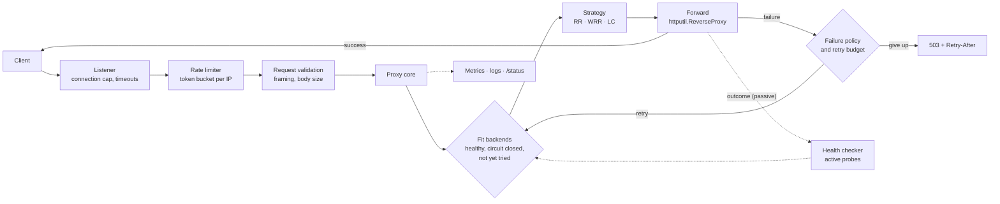
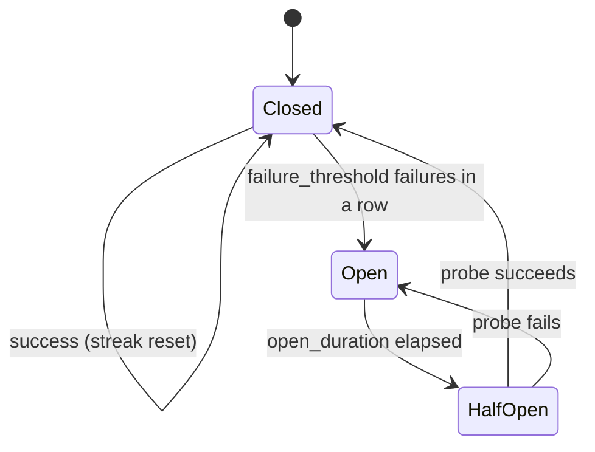

# Ege-Balancer: Design and Evaluation of a Modular HTTP Load Balancer in Go

**Technical design document, version 1.8**

| | |
| --- | --- |
| Author | Berk Egemen Oğuz |
| Date | 11 September 2026 |
| Version | 1.8 — supersedes v1.6 and the v1.7 revision notes |
| Status | Describes v1.0.0 as released and the work since: benchmarks with regression guards, the retry budget, the power of two choices (§5.4), liveness and readiness probes (§8.2), the retry rule for requests that are not idempotent (§6.3), request identifiers (§8.2), and the second measurement campaign against the profiled backends (§10.8), up to v1.3.0 |
| Code | `github.com/berkegemenoguz/ege-balancer` |
| Language | English. A Turkish edition with the same content is [technical-design-v1.8-tr.md](technical-design-v1.8-tr.md) |

---

## Abstract

This document describes the design, implementation and evaluation of Ege-Balancer, an HTTP
reverse proxy and load balancer written in Go and built to a twelve-day plan. The system offers
three selection strategies (round robin, smooth weighted round robin and least connections),
active and passive health checking, three configurable failure policies, per-client rate
limiting, configuration reload without dropping connections, and Prometheus-based
observability. We report how the design held up against the implementation: which decisions
survived, which were revised and why. Load testing on a single ten-core machine exposed three
bottlenecks — upstream connections not being reused, health checking emptying the pool under
saturation, and a 32 KB allocation per request — whose removal raised throughput at 100
concurrent connections sevenfold, from 5,888 to 40,616 requests per second, and lowered p99
latency from 261 ms to 7.7 ms. Two of those fixes are now guarded by deterministic tests that fail
when the fix is reverted. After the release we added a retry budget that caps retries in flight at
a share of the requests in flight; against four failing backends it reduced the attempts reaching
them from 200 to 62 for 50 concurrent requests. Finally we replace the scan in least connections with
the power of two choices — sampling two backends at random and taking the less loaded one. It
removed a bias toward the first backend in the pool (100 of 100 sequential requests before, at most
18 after), made selection cost independent of the pool size (14 ns at 10, 100 and 1,000 backends,
against 484 ns for the scan at 1,000), and still keeps slow backends avoided under sustained load.
A second measurement campaign, against backends with realistic latencies and capacities, compares
the three strategies under a pool that is not uniform. An equal share of an unequal pool caps
throughput at its weakest backend: round robin sends 10% of the traffic to a backend worth 3% of the
capacity and refuses 3.6% of requests at 100 connections, where capacity-proportional weights and
least connections each answer 72% more requests with none refused. We also show where least
connections loses its signal — an overloaded backend that refuses instantly holds nothing in flight,
and so looks idle.

---

## Contents

1. [Introduction](#1-introduction)
2. [Background and related work](#2-background-and-related-work)
3. [Goals and scope](#3-goals-and-scope)
4. [System design](#4-system-design)
5. [Load balancing](#5-load-balancing)
6. [Failure handling](#6-failure-handling)
7. [Resource protection and security](#7-resource-protection-and-security)
8. [Observability](#8-observability)
9. [Implementation and process](#9-implementation-and-process)
10. [Evaluation](#10-evaluation)
11. [Discussion](#11-discussion)
12. [Limitations and future work](#12-limitations-and-future-work)
13. [Conclusion](#13-conclusion)
- [References](#references)
- [Appendix A — Configuration reference](#appendix-a--configuration-reference)
- [Appendix B — Deviations from the original design](#appendix-b--deviations-from-the-original-design)
- [Appendix C — Version history](#appendix-c--version-history)

---

## 1. Introduction

A load balancer sits between clients and a pool of interchangeable backends. For every request it
must choose a backend, forward the request, and return the answer — and when a backend is slow,
failing or gone, it must decide what the client sees. Mature proxies such as nginx, HAProxy and
Envoy make these decisions well, but their behaviour is spread across large code bases and years
of configuration options. This project builds a small one from first principles, with every
decision written down, measured where it can be, and kept replaceable.

The system was specified in a design document (v1.6) before any code was written, then built to
a twelve-day plan and released as v1.0.0. This version of the document replaces the plan with a
description of the system as it exists, keeps the original reasoning where it held, and records
where it did not.

The contributions of the work are:

1. **A modular design** in which configuration, selection, health checking, forwarding and
   observability are separate packages meeting at small interfaces, so that each can be tested
   alone and replaced without touching the others (§4).
2. **An account of failure handling under overload**, including two behaviours the original design
   missed: offering the request to an all-unhealthy pool rather than refusing it (§6.2), and
   bounding retries across all requests rather than only per request (§6.5).
3. **A measured evaluation**: a load test with profiling that located three bottlenecks, the
   effect of removing each, microbenchmarks of every hot path, and regression guards that turn two
   of the fixes into failing tests (§10).
4. **An improvement to least connections**, the power of two choices, motivated by a bias we
   measured in the original implementation and evaluated against it (§5.4, §10.7).

The remainder of the document is organised as follows. §2 places the design among existing work.
§3 states the goals and what is out of scope. §4 through §8 describe the system. §9 describes how
it was built. §10 evaluates it, §11 discusses what the evaluation means, §12 lists its limits, and
§13 concludes.

---

## 2. Background and related work

**Reverse proxies.** nginx [7] and HAProxy [8] established the event-driven reverse proxy as the
standard front end for HTTP services; Envoy [5] added a programmable data plane with rich
resilience features. Go's standard library ships `httputil.ReverseProxy` [10], which handles the
protocol details of forwarding — hop-by-hop headers, `X-Forwarded-For`, streaming — and leaves
routing and policy to the caller. Ege-Balancer is built on it.

**Selection strategies.** *Round robin* hands out requests in turn. *Weighted round robin* does so
in proportion to configured weights; nginx's *smooth* variant [7] interleaves the turns of a heavy
backend rather than bunching them. *Least connections* sends each request to the backend with the
fewest requests in flight, which adapts to backends that differ in speed; HAProxy calls it
`leastconn` [8]. Scanning every backend for the minimum is O(n), and, as §5.3 shows, sensitive to
how ties are broken. *The power of two choices* [1, 2] samples two backends uniformly at random and
takes the less loaded: in the balls-into-bins model this lowers the maximum load from
Θ(log n / log log n) to Θ(log log n) — an exponential improvement from a second sample — and it
degrades gracefully when load information is stale [3]. Envoy's default least-request balancer
uses it [5].

**Failure handling.** Health checking removes backends that fail probes (active) or real traffic
(passive). When health checking removes *every* backend, Envoy's *panic threshold* routes to the
whole pool anyway [5], on the reasoning that a pool believed dead may be merely slow. The *circuit
breaker* [9] stops sending traffic to a backend that fails repeatedly and lets a single probe
through after a cool-down. Retries hide transient failures but multiply load precisely when
backends are failing; the SRE literature recommends bounding them by a *retry budget* [4], which
Envoy expresses as a share of active requests [5] and Finagle as a token bucket over a time window
[6]. Dean and Barroso discuss the same tension from the side of tail latency [11].

**Queueing.** Little's law [12] — the mean number of requests in a system equals the arrival rate
times the mean time in the system — explains two observations in §10: latency growing linearly
with concurrency once throughput saturates, and least connections having nothing to balance when
backends answer in microseconds.

---

## 3. Goals and scope

### 3.1 Functional goals

- Distribute incoming HTTP requests across a pool of backends.
- Three selection strategies, chosen in configuration: round robin, least connections and
  weighted round robin.
- Active and passive health checking, removing an unhealthy backend and returning it once it
  recovers.
- Configurable failure policies: retry on another backend, fail fast, or circuit breaking.
- Graceful shutdown, and configuration reload on `SIGHUP` without dropping connections.
- Structured logs, Prometheus metrics and a human-readable status endpoint.

### 3.2 Target environment

A small to medium load balancer on a single machine, in front of several backend processes. The
reference environment runs on one developer machine under Docker Compose: ten mock backends, the
balancer, Prometheus and Grafana. "Production ready" means ready to move to a real server — a
minimal non-root image, health endpoints, graceful shutdown, CI — not that a deployment exists.

### 3.3 Out of scope

- TLS termination, HTTP/2 and gRPC.
- Distributed or multi-node balancing and service discovery.
- Sticky sessions: backends are assumed stateless.
- A hand-written epoll event loop. The original design planned one as an optional learning
  exercise; it was not carried out, and nothing in the system depends on it (§4.3).

---

## 4. System design

### 4.1 Architecture

A request passes through a fixed chain. The listener accepts the connection under a connection
cap; the rate limiter and request validation may refuse it; the proxy core chooses a backend among
those that are healthy and not tripped, forwards the request, and applies the failure policy if
the attempt fails. Health checking runs beside the chain and feeds it; metrics observe it.



*Figure 1 — The request path. Solid arrows are the request; dotted arrows are state flowing into
and out of it.*

### 4.2 Packages and interfaces

```
cmd/lb/                    entry point: reads configuration, builds the logger, runs the app
cmd/demo/                  local console for driving the demo stack (not part of the image)
cmd/mockbackend/           mock backend for the demo environment (not part of the image)
internal/app/              wiring, shared by the binary and the integration tests
internal/config/           parsing, defaults, validation, reload rules
internal/balancer/         Backend, the LBStrategy interface and the three strategies
internal/health/           active and passive health checking
internal/proxy/            forwarding, failure policies, retry budget, rate limiting, validation
internal/server/           listeners, connection cap, graceful shutdown
internal/observability/    structured logging, Prometheus metrics, /status, pprof
internal/integration/      end-to-end tests over real sockets
```

Wiring lives in `internal/app` rather than `main` so that the integration tests assemble exactly
the chain the binary runs; `cmd/lb/main.go` only reads the configuration, installs the logger and
calls `app.New`. The packages meet at two interfaces:

```go
// internal/balancer
type LBStrategy interface {
    Select(backends []*Backend) (*Backend, error)
    Name() string
}

// internal/health
type Checker interface {
    Start(ctx context.Context, backends []*Backend)
    IsHealthy(addr string) bool
    ReportSuccess(addr string)
    ReportFailure(addr string)
    Reload(ctx context.Context, cfg config.HealthCheck, backends []*Backend)
}
```

A `Backend` carries its address and two atomics: its weight, which a reload may change while
requests are balanced on it, and its count of requests in flight, which least connections reads.
Health is deliberately *not* a field of `Backend`: it is held by the checker, keyed by address, so
that active and passive checking feed the same counters and health survives a rebuild of the pool.

### 4.3 Concurrency model

Each connection is served by its own goroutine; code is written synchronously while Go's runtime
netpoller multiplexes the sockets, on Linux through epoll. The original design proposed a second,
optional phase in which an epoll loop would be written by hand for learning; the evaluation (§10.2)
found the remaining CPU profile dominated by system calls with no hot spot in the balancer's own
code, which gives no performance reason to revisit it.

Shared state is protected according to how it is used:

| State | Protection | Why |
| --- | --- | --- |
| Round robin position | one atomic counter | a single increment per selection |
| Requests in flight per backend | atomic counter on `Backend` | read by least connections, written by every request |
| Backend weight | atomic on `Backend` | changed by reload while being read (§11.1) |
| Weighted round robin credit | mutex | a read-modify-write across the whole pool |
| Health state | read-write mutex in the checker | read on every request, written by probes and reports |
| Circuit state | mutex in the breaker | small, write-heavy while a backend fails |
| Forwarding settings | `atomic.Pointer` to an immutable snapshot | replaced wholesale on reload |
| Retry budget | two atomic counters | on every request; no lock (§6.5) |

### 4.4 Configuration and reload

Configuration is a YAML file, decoded strictly — an unknown field is an error — then defaulted and
validated. Validation reports every problem at once rather than the first. The full schema is in
Appendix A.

On `SIGHUP` the file is read and validated again. If it is invalid, nothing changes and the
failure is logged and counted. If it is valid, the forwarding settings are rebuilt into a new
immutable snapshot and published with a single atomic store. A request reads the snapshot once
when it starts and uses it to the end, so a reload can never leave one request using the new pool
with the old failure policy. Backends that survive a reload keep their `Backend` object — and so
their in-flight count — and their health streak. Settings bound to a socket (`listen_addr`,
`metrics_addr`, `max_connections`, the timeouts, `enable_pprof`) cannot change while serving; a
reload applies everything else and logs which of these it left alone.

---

## 5. Load balancing

All strategies implement `LBStrategy`. The proxy core first narrows the pool to backends that are
healthy, whose circuit is closed, and that this request has not tried yet; the strategy chooses
among those. Keeping filtering out of the strategies keeps each strategy a pure function of the
pool it is given.

### 5.1 Round robin

A single atomic counter is incremented per selection and taken modulo the pool size. Selection is
O(1) and lock-free. It is the right choice when backends are equal, and it is exact: over ten
backends, a multiple of ten requests divides evenly.

### 5.2 Smooth weighted round robin

The original design described weighted selection as probabilistic. The implementation uses nginx's
smooth weighted round robin [7] instead, which is deterministic. For each selection:

1. every backend's credit is raised by its weight;
2. the backend with the most credit is chosen;
3. its credit is lowered by the sum of all weights.

The result hits the configured ratio exactly rather than on average, and spreads a heavy backend's
turns across the cycle: weights 5, 1, 1 produce `a a b a c a a` rather than `a a a a a b c`.
Because there is no random source, the tests are exact instead of statistical — 1,200 requests over
weights 1, 2 and 3 divide into exactly 200, 400 and 600. Credit is keyed by address, so it remains
meaningful while the pool offered to the strategy changes as backends leave and rejoin. The cost is
a scan of the pool under a mutex: O(n) per selection (§10.4).

### 5.3 Least connections

Every request increments its backend's in-flight counter before it is forwarded and decrements it
when it finishes, retries included. Up to v1.0.0, least connections scanned the pool and returned
the backend with the lowest count; ties went to the earliest backend in the pool.

It adapted to backends of different speed, which the integration suite demonstrated: with one slow
and two fast backends, 60 concurrent requests gave the slow backend 16 and the fast pair 44. It had
two weaknesses, both visible in this project:

- **A bias toward the first backend.** Ties are frequent whenever backends answer faster than
  requests arrive. By Little's law, at 20 requests per second and one millisecond per request the
  average number of requests in flight is 0.02, so nearly every selection sees all counters at zero
  and picks the first backend. Measured over real sockets with ten equal backends, 100 sequential
  requests all went to `backend-1`; 100 concurrent requests gave it 16 and each of the others
  between 7 and 14.
- **Herding.** Requests that arrive together read the same counters before any of them has
  incremented one, and all choose the same backend.

Selection was also O(n): 3.9 ns over ten backends, 47 ns over a hundred and 484 ns over a
thousand. That cost is small next to forwarding, but it grows with the pool for no benefit.

### 5.4 Power of two choices

> **Status:** implemented for v1.1.0; §10.7 evaluates it against the scan it replaced.

**Algorithm.** For a pool of n backends:

- n = 0: no backend (503, as today);
- n = 1: that backend;
- n ≥ 2: draw two *distinct* indices uniformly at random, compare the two backends' in-flight
  counts, return the lower; on a tie, return the first drawn.

Distinct indices are drawn as `i = rand(n)`, `j = rand(n−1)`, and `j++` if `j ≥ i`, which needs no
retry loop. With n = 2 the two samples are the whole pool, so the choice is exactly least
connections. The strategy keeps its configuration name, `least_connections`, as Envoy's least
request balancer does; configurations do not change.

**Why it addresses §5.3.**

- *The bias disappears.* When every count is equal, the choice is the first of two random draws —
  uniform over the pool — instead of always the first backend.
- *Herding is reduced.* Concurrent requests sample different pairs, so they spread even when they
  read the same counters. This is the setting of Mitzenmacher's analysis of stale load
  information [3], in which sampling two choices remains effective while choosing the global
  minimum of old information behaves badly.
- *Load stays balanced.* In the balls-into-bins model the maximum load with two choices is
  Θ(log log n) against Θ(log n / log log n) for one random choice [1, 2]; the second sample buys
  almost all of the benefit of a full scan.
- *Selection becomes O(1)*: two random numbers and two atomic loads, whatever the pool size.

**Randomness and tests.** The strategy draws from `math/rand/v2`'s top-level functions, which are
safe for concurrent use and need no lock in the caller. Deterministic tests were a principle of the
original implementation (§5.2); to keep them, the source of random indices is a field of the
strategy, set to a seeded generator in unit tests, so that a failing test can be reproduced.

**What does not change.** Filtering (health, circuit, already tried) happens before the strategy,
so a sample can never land on an unfit backend. Weighted round robin and round robin are
unaffected.

---

## 6. Failure handling

### 6.1 Health checking

*Active* checking probes `health_check.path` on every backend each `interval`, with its own
`timeout`. *Passive* checking is driven by the proxy, which reports the outcome of every attempt.
Both feed one pair of consecutive-outcome counters per backend: `unhealthy_threshold` failures in a
row remove it, `healthy_threshold` successes in a row return it. A backend therefore leaves the pool
as soon as real traffic fails on it, without waiting for the next probe. Backends start healthy so
that traffic flows before the first probe completes, and an address the checker does not know is
treated as healthy.

### 6.2 An all-unhealthy pool is still tried

The original design did not say what to do when health checking has removed every backend. The
load test answered it: at saturation the probes were among the first requests to time out, every
backend was marked unhealthy at once — 172 removals paired with 172 recoveries — and the balancer
refused 275,769 requests with nothing actually down. A slow system had become a broken one.

When nothing in the pool is fit, the request is now offered to the untried backends anyway, and the
fallback is counted as `no_healthy_backend`. This is Envoy's panic mode [5]. A backend that may
still answer is worth one attempt; one that is genuinely dead costs one failed attempt, after which
the client receives the 503 it would have received anyway. The observable consequence: when every
backend is unhealthy but still answering, the client receives the backend's own response.

### 6.3 Failure policies

A failed attempt is a refused or timed-out connection, a backend that does not start answering
within `response_timeout`, or — only when `retry_on_5xx` is set — a 5xx answer.

| Policy | Behaviour on a failed attempt |
| --- | --- |
| `retry_next_backend` | try another backend that this request has not tried, up to `max_retries` times, within the retry budget (§6.5) |
| `fail_fast` | answer the client at once |
| `circuit_breaker` | answer the client at once, and count the failure towards opening the backend's circuit |

A retry never repeats a backend within one request. To be replayable, a request body is buffered
when retries are possible, up to `max_request_body_bytes`; with a single attempt it is streamed
straight through.

Whether a request may be retried at all depends on its method. An idempotent request — GET, HEAD,
PUT, DELETE, OPTIONS, TRACE, as RFC 9110 defines them — is retried after any failure. A request
that is not, which is POST, PATCH or a method the balancer does not know, is retried only when the
connection to the backend was never made: that is the one failure which proves no backend saw the
request. Any later failure, including a 5xx answer under `retry_on_5xx`, ends the request with 503
counted as `not_retryable`, because the backend may have carried the request out and answered into
a connection that then broke, and a second attempt would place a second order (Appendix B, entry
15).

### 6.4 Circuit breaker



*Figure 2 — The circuit of one backend. While Open, and while a half-open probe is in flight, the
backend is excluded from selection.*

The breaker is independent of health checking: health reflects whether a backend answers probes,
the circuit whether it has been failing real traffic. Exactly one request is let through as the
probe; everything else waits for its outcome.

### 6.5 Retry budget

`max_retries` bounds the retries of one request. It does not bound retries across requests: when a
pool starts failing, every request retries at once and the traffic reaching the backends grows by up
to 1 + `max_retries` times — at the moment they can least absorb it. This is the retry storm the SRE
literature warns about [4].

The balancer therefore keeps a budget, following Envoy [5]. It counts the requests in flight and the
retries in flight, and allows a retry only while

```
retries_in_flight < max(min_retry_concurrency, budget_percent × requests_in_flight)
```

with defaults of 20% and 3. The minimum keeps retries possible under light traffic, where 20% of the
load rounds down to nothing. A retry the budget refuses is not sent: the client receives 503 with
`Retry-After`, and the refusal is counted as `retry_budget_exhausted`.

We chose this model over Finagle's token bucket [6] because it has no time window or refill rate to
tune, follows the load at every instant, and needs two atomic counters and no lock. The budget
belongs to the configuration snapshot: a reload builds a new, empty one, and requests in flight keep
the budget they started with, so no counter is ever decremented on the wrong instance. The budget is
on by default; a configuration that does not mention it gets the defaults, and light traffic retries
exactly as before.

### 6.6 What the client sees

| Situation | Response | Rejection reason |
| --- | --- | --- |
| Over the per-client rate | 429, `Retry-After: 1` | `rate_limited` |
| Ambiguous framing (two `Content-Length`s, or `Content-Length` with `Transfer-Encoding`) | 400 | `bad_framing` |
| Body over `max_request_body_bytes` | 413 | `body_too_large` |
| Every attempt failed, or no backend to try | 503, `Retry-After: 5` | `no_backend_available` |
| A retry refused by the budget | 503, `Retry-After: 5` | `retry_budget_exhausted` |
| A failed POST or PATCH a backend may already have carried out | 503, `Retry-After: 5` | `not_retryable` |
| Backend answered 5xx, `retry_on_5xx: false` | the backend's own response | — |
| Every backend unhealthy but answering | the backend's own response | `no_healthy_backend` (counted, not refused) |

---

## 7. Resource protection and security

Security in this version is a set of cheap measures with a large effect, rather than a heavy
layer.

- **Connection cap.** The traffic listener refuses connections beyond `max_connections`. The
  observability server has no cap, so that it keeps answering exactly when the traffic port is
  saturated.
- **Timeouts on every phase.** Connect, response, read, write and idle each have a bound, so a slow
  client or backend cannot hold resources indefinitely.
- **Per-client rate limiting.** One token bucket per client address, refilled at
  `rate_limit_per_ip` per second with a burst of the same size. The address is the socket peer, never
  a header the client could forge. Buckets idle for ten minutes are swept once 10,000 clients are
  tracked, so one-off clients cannot grow memory without bound. A reload changes the rate without
  resetting the buckets.
- **Request smuggling.** Requests whose body framing could be read two ways are refused before a
  backend sees them (§6.6), following RFC 9112 [13]. Go's server already refuses the clearest cases;
  the check is repeated so the proxy does not depend on it.
- **Forwarding headers.** `X-Forwarded-For` and related headers are rewritten, not appended to, so a
  client cannot forge the address a backend sees.
- **Separate observability port.** `/metrics`, `/status`, `/healthz`, `/readyz` and the optional
  pprof endpoints are served on `metrics_addr`, never on the traffic port. pprof is off by default because it exposes heap and
  goroutine state.
- **Supply chain and image.** CI runs `govulncheck` on every push. The image is built in two stages
  and runs on `distroless/static:nonroot` — 22.6 MB, no shell, no package manager, a non-root user.

---

## 8. Observability

### 8.1 Metrics

| Metric | Type | Labels | Meaning |
| --- | --- | --- | --- |
| `lb_requests_total` | counter | backend, status | requests answered by a backend |
| `lb_request_duration_seconds` | histogram | backend | time to serve, measured at the balancer |
| `lb_backend_failures_total` | counter | backend | attempts a backend could not serve |
| `lb_retries_total` | counter | — | retries sent |
| `lb_rejected_requests_total` | counter | reason | requests the balancer refused itself (§6.6) |
| `lb_config_reloads_total` | counter | result | reloads applied or rejected |
| `lb_backend_active_connections` | gauge | backend | requests in flight, read at scrape time |
| `lb_backend_healthy` | gauge | backend | 1 healthy, 0 not, read at scrape time |

The two gauges are read from the live state when Prometheus scrapes, rather than mirrored into
separate variables, so there is no second copy of the state to drift.

### 8.2 Status, logs and profiling

`/status` answers a person rather than a scraper: the algorithm, the healthy count, the number of
reloads applied, and each backend's weight, health and in-flight count. Logs are structured JSON
(or text) through `log/slog`. `/debug/pprof` is available on the metrics port when enabled.

Every request carries an identifier, which ties those logs to the backend's own. It is taken from
the client's `X-Request-Id` when that is printable ASCII of at most 64 characters — so a trace that
started before the balancer is not broken here — and generated otherwise, from `crypto/rand`. It is
returned to the client, sent on to the backend in the same header, and logged as `request_id`. It is
assigned outermost, before rate limiting and validation, so a request the balancer refuses itself
can be traced as well as one it forwards (Appendix B, entry 16).

Two further endpoints answer an orchestrator rather than a person. `/healthz` reports liveness and
answers 200 for as long as the process answers at all. `/readyz` reports readiness: 200 while at
least one backend is healthy, by the same health checker `/status` reads, and 503 when none is or
once a shutdown has begun. The two are kept apart on purpose: a balancer whose backends are all
down is still working, and restarting it would bring no backend back, so only readiness depends on
the pool.

On shutdown the balancer first reports itself not ready, then drains the traffic port, and stops
the metrics port only after the traffic port has drained. Stopping both together, as before, took
`/readyz` away at the one moment it had something to say. The distroless image has no shell or
`curl` to run a container health check with, so the binary checks itself: `lb -probe <url>` exits 0
on a 200 and 1 otherwise, and the Compose file runs it against `/healthz` (Appendix B, entry 14).

### 8.3 Monitoring stack

The Compose environment runs Prometheus, scraping every five seconds, and Grafana with three provisioned, linked dashboards. *Overview* is the one to keep on screen:
headline figures, request rate and share of traffic per backend, latency and a health timeline.
*Backends* compares the backends — a table, share of traffic, requests in flight averaged over a
window, p95 latency per backend and a latency heatmap. *Resilience* shows what failures do:
answers by status class, refusals by reason, retries against the budget and reloads.

Three choices make them readable. Every graph marks configuration reloads, so the effect of a
change is seen against the moment it was made. Each backend keeps the colour of its profile
(§9.4). And the in-flight gauge is shown averaged: sampled every five seconds at light load it
reads mostly 0 or 1, which says nothing about how busy a backend is. The dashboards are generated
by a script, so the three stay consistent. Two resource findings from
running it are recorded in Appendix B (entry 7): Grafana needs a Go memory budget (`GOMEMLIMIT`)
rather than a larger limit, and Prometheus fits its 256 MB.

---

## 9. Implementation and process

### 9.1 The plan and how it went

| Day | Planned | What was delivered |
| --- | --- | --- |
| 1 | Project setup, mock environment | repository skeleton, CI, ten `http-echo` backends |
| 2 | Configuration module | strict YAML parsing, defaults, validation reporting every problem |
| 3 | Listener and proxy core | listener with connection cap, graceful shutdown, forwarding |
| 4 | Round robin | `LBStrategy`, round robin |
| 5 | Least connections, weighted round robin | in-flight counters, *smooth* weighted round robin |
| 6 | Health checker | active and passive checking on shared counters |
| 7 | Proxy core completion | validation, rate limiting, timeouts, failure policies, circuit breaker |
| 8 | Logging and metrics | slog, Prometheus, `/status`, Prometheus and Grafana stack |
| 9 | Integration tests | end-to-end suite over real sockets |
| 10 | Load testing and profiling | three bottlenecks found and removed; performance report |
| 11 | Resilience and reload | failure scenarios verified, `SIGHUP` reload, response timeout |
| 12 | Production readiness, release | distroless image, release workflow, deployment checklist, v1.0.0 |

The optional epoll exercise planned beside days 10 and 11 was not carried out (§4.3).

### 9.2 Workflow

The original design prescribed a protected `main`, feature branches and pull requests. With a single
developer and no reviewer, that adds process without a gate, so work is committed directly to `main`
and CI is the gate: every push runs gofmt, `go vet`, golangci-lint, govulncheck, the build, the full
test suite under the race detector, and an image build. A tag `vX.Y.Z` runs the release workflow,
which tests again, builds the image, pushes it as the tag and as `latest`, and publishes the release
notes. Commit messages follow Conventional Commits. If a team forms, the pull request flow can be
turned back on; CI already runs what it would need.

A second workflow runs the benchmarks on every push, runs them again on the code as it was before
the push on the same runner, and puts the benchstat [14] comparison in the run summary. It reports
and never fails: timings on shared runners drift by several per cent between identical runs.

### 9.3 Testing

The suite holds 137 test functions, 27 of them integration tests that start the assembled balancer
on real sockets, and 10 benchmarks. Unit coverage by package:

| Package | Coverage |
| --- | --- |
| `balancer` | 100.0% |
| `observability` | 98.8% |
| `health` | 97.9% |
| `proxy` | 94.3% |
| `config` | 90.3% |
| `server` | 83.7% |

The integration tests write their configuration to a file and load it through the same path as the
binary, so defaults and validation are exercised with everything else.

### 9.4 The demo environment

Up to v1.1.0 the ten backends of the Compose environment were `hashicorp/http-echo`, which answers
every request at once with a fixed text. Three things depended on that and suffered for it: least
connections had nothing to balance, the load test forwarded ten-byte bodies, and every backend was
equal. They are now one program, `cmd/mockbackend`, run with a profile per backend:

| Setting | Meaning |
| --- | --- |
| `latency`, `latency-p99` | median and 99th percentile of the time a request is served, drawn from a log-normal distribution |
| `capacity`, `queue` | requests served at once, and requests that may wait; beyond the queue the backend answers 503 |
| `body-size` | size of the answer, with the backend's name on its first line |
| `error-rate` | share of requests answered with 500 |
| `seed` | makes the sequence of latencies and failures repeatable |

Latency is spent only while a request holds a worker, so a backend with little capacity slows down
under load as its queue grows, the way a real server does; its `/healthz` answers 503 while the
queue is more than half full. Every backend also names itself in an `X-Backend` header.

| Backends | Profile | Latency (median, p99) | Capacity, queue | Answer |
| --- | --- | --- | --- | --- |
| 1–6 | fast | 15 ms, 80 ms | 64, 128 | 4 KiB |
| 7–8 | medium | 30 ms, 200 ms | 32, 64 | 4 KiB |
| 9 | slow | 80 ms, 500 ms | 16, 32 | 4 KiB |
| 10 | large answers | 15 ms, 80 ms | 64, 128 | 256 KiB |

The integration tests do not use the mock. They build their own backends in Go, where a test can
slow one down, make it fail or kill it.

---

## 10. Evaluation

### 10.1 Method

| | |
| --- | --- |
| Machine | Apple silicon, 10 cores, macOS |
| Balancer | one process, `GOMAXPROCS` at the default |
| Backends | ten trivial HTTP servers in one process, ten-byte body |
| Configuration | round robin, `retry_next_backend` with two retries, rate limiting off, `max_connections: 10000` |
| Duration | ten seconds per level, connections held open throughout |

The load generator, backends and balancer share the machine, so absolute numbers are a floor; the
comparisons between runs carry the meaning, since every run shares the handicap. `ab` produced the
reference measurements but is single-threaded and failed at a thousand connections
(`apr_socket_recv: Operation timed out`). Above that, a purpose-built driver was used — one goroutine
per connection, keep-alive, per-request latency recorded — after being checked against a backend
directly at 108,000 requests per second, to establish that the numbers describe the balancer and not
the generator.

A second campaign, after v1.3.0, repeated the exercise against the profiled mock backends (§9.4)
to compare the three algorithms rather than the balancer's own cost. Its method and results are in
§10.8; its generator, `cmd/loadgen`, is part of the repository, so it can be run again.

### 10.2 Bottlenecks

The first run was far worse than the backends alone: 5,888 requests per second at 100 connections,
p99 261 ms and 6% failures; at 1,000 connections every request failed.

**Upstream connections were not reused.** The CPU profile put 93% of the time in system calls and 2%
in the balancer's own logic; the log said `connect: can't assign requested address`, with over a
thousand sockets in `TIME_WAIT`. Go's default transport keeps two idle connections per host, so
under load nearly every request opened a new connection and the ephemeral port range ran out. The
idle pool is now sized from the configuration: `max_connections` in total, divided across the
backends with a floor of 32 each.

**Health checking emptied the pool.** With connections reused, saturation made the probes time out
and every backend was removed at once (§6.2). The fallback to the untried pool fixed it.

**A 32 KB allocation per request.** The heap profile attributed 80.8% of all allocation to
`ReverseProxy`'s copy buffer: 56 GB over a twenty-second run, with a live heap of only 22 MB —
pressure on the collector rather than a leak. A `sync.Pool`-backed buffer pool removed it.

| Change | Connections | Before | After |
| --- | --- | --- | --- |
| Reused upstream connections | 100 | 5,888 req/s, p99 261 ms, 6% failures | 28,431 req/s, p99 10 ms, no failures |
| Reused upstream connections | 1,000 | every request failed | 35,075 req/s |
| Buffer pool | 500 | 32,147 req/s, p99 41.4 ms | 41,829 req/s, p99 32.4 ms |

### 10.3 Results

| Connections | Throughput | p50 | p95 | p99 | max |
| --- | --- | --- | --- | --- | --- |
| 100 | 40,616 req/s | 2.1 ms | 5.3 ms | 7.7 ms | 26.7 ms |
| 500 | 41,829 req/s | 11.2 ms | 24.0 ms | 32.4 ms | 147.5 ms |
| 1,000 | 41,208 req/s | 23.6 ms | 46.7 ms | 60.2 ms | 122.5 ms |
| 2,000 | 41,421 req/s | 47.3 ms | 87.5 ms | 106.6 ms | 712.6 ms |

No request failed at any level. Throughput is flat from 100 connections at about 41,000 requests
per second, where the shared machine saturates; latency then grows in proportion to concurrency, as
Little's law predicts for a saturated server [12]. Against the baseline, throughput at 100
connections rose sevenfold and p99 fell from 261 ms to 7.7 ms.

The original design set p95 at a thousand connections "in the single digit to low tens of
milliseconds". The measurement is 46.7 ms on a machine also running the generator and all ten
backends; at 100 connections p95 is 5.3 ms. We restate the target in terms of the expected load
rather than as one number (Appendix B, entry 10). The remaining profile is dominated by system calls,
the expected shape for a proxy that mostly moves bytes; further gains would come from the operating
system and network stack, not from the balancer's code.

### 10.4 Microbenchmarks

| Benchmark | Time per operation | Allocations |
| --- | --- | --- |
| Round robin, 10 and 100 backends | 1.9 ns, 1.8 ns | none |
| Least connections, 10, 100 and 1,000 backends | 14 ns at every size | none |
| Weighted round robin, 10 and 100 backends | 177 ns, 1.95 µs | none |
| RR, LC, WRR with 10 goroutines | 36 ns, 2.8 ns, 274 ns | none |
| Health lookup, alone and alongside reports | 7.6 ns, 35 ns | none |
| Rate limiter, one client and many | 12 ns, 102 ns | none |
| Retry budget, alone and with 10 goroutines | 3.5 ns, 144 ns | none |
| Forwarding one request, sequential and parallel | 32 µs, 11 µs | 13 KB, 104 |

Selection is cheap next to forwarding: the slowest case, weighted round robin over a hundred
backends, is about 6% of the cost of forwarding one request. Weighted round robin grows linearly
with the pool; round robin and least connections do not. Round robin is the fastest strategy
alone but slows twentyfold with ten goroutines, because they all increment one counter and the cache
line holding it moves between cores. Nothing on the request path allocates except forwarding itself.

### 10.5 Regression guards

The load test needs the whole environment and a quiet machine, so it cannot run on every change. Two
fixes that a harmless-looking edit could undo each have a deterministic test in the ordinary suite:

| Guard | Measures | Healthy | Fix reverted |
| --- | --- | --- | --- |
| Connection reuse | backend connections opened by 5 rounds of 24 concurrent requests (limit 48) | 24 | 112, fails |
| Allocation budget | bytes allocated per forwarded request (limit 32 KB) | about 13 KB | about 46 KB, fails |

Both were verified by reintroducing the original bug. The second gates on bytes rather than on the
number of allocations, because the count is 104 either way: the missing pool changes the size of one
allocation, not how many there are.

### 10.6 Retry budget under a retry storm

Four backends that each answer 500 after 100 ms, 50 concurrent requests, up to three retries each,
`retry_on_5xx` enabled:

| Budget | Attempts reaching the backends |
| --- | --- |
| The whole load (100%) | exactly 200 — every request tried four times; 150 retries sent |
| The default (20%, minimum 1 in this test) | 62 in every one of 10 runs, and of 20 further runs on two CPUs |

Retries multiplied the load on the failing pool by four without a budget and by 1.24 with it. The
budget costs 3.5 ns alone and 144 ns with ten goroutines contending — about 1% of forwarding a
request in parallel — and forwarding itself was unchanged at 104 allocations and about 13 KB.

### 10.7 The power of two choices against the scan

Each criterion set before the change (§5.4) was measured against the full scan it replaced, on the
machine described in §10.1.

| | Hypothesis | Scan | Power of two choices | Met |
| --- | --- | --- | --- | --- |
| E1 | Selection cost no longer grows with the pool | 3.9, 47, 484 ns at 10, 100, 1,000 backends | 14 ns at all three; no allocation | yes |
| E2 | The first-backend bias is gone | 100 of 100 sequential requests to `backend-1` | at most 18 on any backend in 20 runs; 10,000 idle selections all within 20% of an equal share | yes |
| E3 | Slow backends are still avoided | sustained load: 7 of 200 to a 40 ms backend | 6–11 of 200 | yes, under sustained load |
| E4 | Concurrent arrivals spread | a burst of 50 read before any is acquired: all 50 on one backend | at most 8 on one backend | yes |
| E5 | Reproducibility is kept | — | seeded tests give identical selections across runs | yes |

**Cost.** At ten backends the scan is faster, 3.9 ns against 14 ns, because two random draws cost
more than ten atomic loads; with ten goroutines selecting at once it is 1.3 ns against 2.8 ns. Both
differences are about 0.03% of forwarding one request (§10.4). From about thirty backends upwards
the power of two choices is cheaper, and at a thousand it is 34 times cheaper.

**A single burst.** E3 was first measured with the existing test, in which 60 requests arrive at
once over one slow and two fast backends. There the slow backend served 16 to 20 of the 60 across
20 runs, against 16 for the scan — at worst a third, which is an equal share. Most selections in a
burst see every count at zero, so both strategies choose almost blindly; the scan's 16 came from its
bias toward the first backend, which in that test was the slow one. Under sustained traffic,
requests build up on the slow backend and from then on any pair that includes it is won by the
other backend. The criterion therefore holds under sustained load, and a single burst is the case
where neither strategy can do better than an even spread. A test for the sustained case was added to
the integration suite.

---

### 10.8 The algorithms against a pool that is not uniform

The measurements above used ten identical backends answering ten bytes in microseconds. That is the
right shape for finding the balancer's own bottlenecks and the wrong shape for comparing strategies:
nothing is ever in flight, so least connections has no signal, and every backend is equal, so
weights and capacity differences are never exercised. This campaign drives the release image, in
Compose, against the ten profiled mock backends of §9.4, with `cmd/loadgen` on the host: one
goroutine per connection, keep-alive, closed loop, a five second warmup discarded and twenty seconds
measured.

The profiles bound the pool before the balancer does. Together the ten backends serve 528 requests
at once and queue 1,056 more; beyond that a backend answers 503 immediately. The slow backend —
capacity 16, 80 ms median — is worth 3.0% of that capacity and about 200 requests per second.

| Connections | Algorithm | Answered | p95 | p99 | Refused | Share to the slow backend |
| --- | --- | --- | --- | --- | --- | --- |
| 100 | round robin | 2,141/s | 253.0 ms | 397.9 ms | 3.6% | 10.0% |
| 100 | weighted round robin | 3,660/s | 71.7 ms | 150.6 ms | none | 3.0% |
| 100 | least connections | 3,677/s | 71.2 ms | 151.0 ms | none | 2.8% |
| 300 | round robin | 5,523/s | 107.0 ms | 334.3 ms | 7.6% | 10.0% |
| 300 | weighted round robin | 5,082/s | 126.5 ms | 325.4 ms | 0.3% | 3.0% |
| 300 | least connections | 5,352/s | 114.2 ms | 177.4 ms | none | 2.6% |
| 2,000 | round robin | 3,518/s | 2.248 s | 2.930 s | 6.4% | 10.0% |
| 2,000 | weighted round robin | 3,292/s | 2.691 s | 3.586 s | none | 3.0% |
| 2,000 | least connections | 3,266/s | 2.661 s | 3.251 s | 6.0% | 10.1% |

Each figure is the median of three runs; six levels from 50 to 2,000 connections were measured, and
the performance report carries all fifty-four. The algorithms are interleaved at each level and
their order rotated each repeat, because a first attempt that ran them in blocks drifted downwards
through the session and would have credited whichever went first. Five results matter.

**An equal share of an unequal pool caps the pool at its weakest member.** Round robin's
distribution is 10.0% per backend at every level, to three digits: the strategy does exactly what it
promises. But the slow backend is worth 3.0%, so from 100 connections it is past its capacity and
refusing, and every one of round robin's 503s comes from it — 3.6% of requests at 100 connections and
6.4% to 7.6% at every level above. This is a result about choosing a strategy, not about the
implementation.

**Weights and least connections find the same distribution by different means.** Weighted round
robin gave the slow backend 3.0%, the capacity-proportional weight it was configured with. Least
connections arrived at 2.6–3.1% told nothing about capacity: a slower backend holds its requests
longer, so it looks busier and is chosen less. Below the pool's capacity that is worth 41% more
answered requests at 50 connections and 72% at 100 — 3,677/s against 2,141/s — with no refusals
against 3.6% and p95 of 71 ms against 253 ms.

**At the knee the three converge on throughput and separate on everything else.** At 300
connections, near the pool's 528 concurrent requests, they are within 8% of each other, but round
robin refuses 7.6% and its p99 is 334 ms against least connections' 177 ms. Above the knee round
robin answers slightly more than the others while refusing 6.4% to 6.8%: an overloaded mock refuses
in microseconds, so shedding load is cheap and frees the connection for another request. A
throughput figure that does not separate answers from refusals rewards exactly that.

**Least connections loses its signal under deep overload.** Its share to the slow backend goes 2.6%
at 300 connections, 5.3% at 1,000 and 10.1% at 2,000 — by then no better than round robin, with 6.0%
refused. The cause is the same instant refusal: a backend whose queue is full answers 503 at once,
its in-flight count drops to nothing, and it becomes the least busy backend in the pool. Counting
requests in flight measures occupancy, and an instant refusal is indistinguishable from idleness
(§12).

**The balancer is the most expensive component above the knee.** Sampling `docker stats` through
each window puts the balancer at 138% of a core at 300 connections against 137% for all ten backends
together, and at 165–187% against 116–125% at 2,000. What the client sees then is mostly queueing in
front of it: the balancer's own histogram reports p95 of 241 ms for traffic whose client-side p95 is
2.9 s, the client's distribution has two humps — 50 ms and 2–5 s — and the seconds-long wait appears
on every backend answering 4 KiB, which is the shape of a queue before the choice rather than behind
it. The latency at that level therefore describes the machine, not the balancer.

**What the balancer itself did.** Across all eighteen runs `lb_rejected_requests_total` and
`lb_retries_total` did not move: every 503 the client saw came from a backend, and with
`retry_on_5xx` off the balancer passed those answers through. The generator reads both counters at
the ends of the measured window, so this is measured rather than assumed.

**Losing a backend costs single-digit retries.** One run per algorithm at 600 connections had a fast
backend carrying 12% of the traffic taken away ten seconds into the measurement, both by SIGTERM,
which the mock drains, and by SIGKILL, which resets every open connection. Even the crash cost
between seven and ten retries out of roughly 100,000 requests, with no client-visible error under
either weighted round robin or least connections. Passive health checking is what makes it cheap:
three consecutive failed attempts remove the backend, and at these rates three failures take
milliseconds, where the active probe would have needed up to six seconds.

---

## 11. Discussion

### 11.1 Defects found after the release

The race detector found two latent data races after v1.0.0, both only in CI, and both from the
plan's days rather than from new work:

- a test written on day 9 whose mock backend handler wrote unguarded variables while the health
  checker's probe hit the same handler;
- the reload added on day 11 wrote a surviving backend's weight as a plain field while `/status`
  and, under real traffic, weighted round robin read it. The weight is now atomic and reachable only
  through accessors, so an unsynchronised write no longer compiles; a test changes weights while a
  strategy selects and fails under `-race` with the plain field restored.

Both had passed locally many times. The lesson is not that the race detector is unreliable but that
it finds only the interleavings that happen: a slower, busier CI runner produced interleavings a
fast development machine did not. Running the whole suite under `-race` on every push is what found
them.

### 11.2 Where the design was wrong, and why that was useful

Most deviations (Appendix B) are refinements; three changed behaviour in ways the design did not
anticipate. Offering the request to an all-unhealthy pool (§6.2), adding a response timeout, and
bounding retries across requests (§6.5) all come from the same place: the design reasoned about one
request failing, and the failures that mattered were many requests failing together. Overload
couples requests that are independent under normal load — through shared probes, shared
connections, shared retries — and the design's per-request view could not see it. Measuring under
load is what exposed each case.

### 11.3 Measuring well

Three measurement lessons recur. First, a benchmark can measure its own scaffolding: the first rate
limiter benchmark reported 16 bytes per call that the limiter did not allocate, because it built
client addresses inside the timed loop. Second, a guard must measure what the bug changes: counting
allocations would not have caught the missing buffer pool, counting bytes does. Third, a behaviour
that exists in theory may have nothing to act on in practice: least connections could not be shown
in the demo environment because, by Little's law, backends answering in about a millisecond at
20 requests per second have almost nothing in flight; it had to be shown with deliberately slow
backends.

### 11.4 Threats to validity

The load test ran on one machine shared with its load generator and backends, so its absolute
figures understate what the balancer can do alone; the comparisons are sound, the absolute numbers
are a floor. The backends were trivial and uniform, which flatters round robin and hides the cases
where least connections helps. The retry storm experiment used four backends and one failure shape;
a different mix of slow and fast failures would give different numbers. Benchmark timings on shared
CI runners vary by several per cent, which is why only bytes and allocations are gated.

---

## 12. Limitations and future work

- **Least connections in a burst.** When many requests arrive at once, most selections see equal
  counts, so a slow backend receives an even share until requests build up on it (§10.7).
- **TLS termination and HTTP/2** remain out of scope; the balancer speaks plain HTTP/1.1.
- **No limit on the requests in flight per backend.** This is the clearest gap the second campaign
  found (§10.8). Least connections tracks capacity until the pool is deeply overloaded, and then
  follows a signal that overload has destroyed: a backend refusing instantly looks idle. An
  admission limit per backend would bound what the strategy cannot see.
- **A larger pool.** The environment has ten backends. A generator for larger pools, such as thirty,
  would let the power of two choices be measured where it overtakes the scan (§10.7).
- **Single node.** Rate limits, circuit state and the retry budget are per process; several balancer
  instances would each enforce their own.
- **No sticky sessions.** Backends must be stateless.
- **Log shipping and alerting** (Loki, Alertmanager) were deferred from v1.0 and are still absent.
- **A real deployment** on a free cloud tier, with a public demo, is still a possible next step.

---

## 13. Conclusion

Ege-Balancer meets the goals set for it: three strategies, health checking, configurable failure
policies, reload without dropped connections, and observability, in a 22.6 MB non-root image,
serving about 41,000 requests per second with no failed request on a machine it shared with its own
load (§10.3) — and, against backends with real latencies and capacities, keeping the pool's weakest
member from setting its ceiling (§10.8). The more durable result is the method. Each decision was written down before it was made;
each was measured where it could be; and each place where measurement disagreed with the design was
recorded, fixed and, where possible, turned into a test that fails if the fix is undone. The three
bottlenecks and all three post-release additions came from measurement, not speculation.

---

## References

1. M. Mitzenmacher. *The Power of Two Choices in Randomized Load Balancing.* IEEE Transactions on
   Parallel and Distributed Systems, 12(10):1094–1104, 2001.
2. Y. Azar, A. Z. Broder, A. R. Karlin, E. Upfal. *Balanced Allocations.* SIAM Journal on
   Computing, 29(1):180–200, 1999.
3. M. Mitzenmacher. *How Useful Is Old Information?* IEEE Transactions on Parallel and Distributed
   Systems, 11(1):6–20, 2000.
4. B. Beyer, C. Jones, J. Petoff, N. R. Murphy (eds.). *Site Reliability Engineering: How Google
   Runs Production Systems.* O'Reilly, 2016. Chapters 21 (Handling Overload) and 22 (Addressing
   Cascading Failures).
5. Envoy Proxy documentation: load balancers (least request), panic threshold, circuit breaking and
   retry budgets. https://www.envoyproxy.io/docs/
6. Finagle documentation: retry budgets. https://twitter.github.io/finagle/guide/
7. nginx documentation and source, `ngx_http_upstream_round_robin.c` (smooth weighted round
   robin). https://nginx.org/en/docs/
8. HAProxy configuration manual: `balance` algorithms, including `leastconn`.
   https://docs.haproxy.org/
9. M. T. Nygard. *Release It! Design and Deploy Production-Ready Software*, 2nd ed. Pragmatic
   Bookshelf, 2018. The circuit breaker pattern.
10. The Go standard library: `net/http`, `net/http/httputil`, `sync`, `sync/atomic`,
    `math/rand/v2`; the Go race detector; the Go garbage collector guide (`GOMEMLIMIT`).
    https://pkg.go.dev/std, https://go.dev/doc/
11. J. Dean, L. A. Barroso. *The Tail at Scale.* Communications of the ACM, 56(2):74–80, 2013.
12. J. D. C. Little. *A Proof for the Queuing Formula: L = λW.* Operations Research, 9(3):383–387,
    1961.
13. R. Fielding, M. Nottingham, J. Reschke (eds.). *HTTP/1.1.* RFC 9112, 2022. §6.3, message body
    length.
14. `benchstat`, `golang.org/x/perf/cmd/benchstat`. https://pkg.go.dev/golang.org/x/perf/cmd/benchstat
15. Prometheus and Grafana documentation. https://prometheus.io/docs/, https://grafana.com/docs/

---

## Appendix A — Configuration reference

```yaml
listen_addr: ":8080"                # traffic; restart to change
metrics_addr: ":8081"               # /metrics, /status, /healthz, /readyz, pprof; restart to change
enable_pprof: false                 # restart to change
algorithm: round_robin              # round_robin | least_connections | weighted_round_robin
failure_policy: retry_next_backend  # retry_next_backend | fail_fast | circuit_breaker
retry_on_5xx: false                 # count a 5xx answer as a failed attempt

retry:
  max_retries: 2                    # at least 1 under retry_next_backend
  budget_percent: 20                # retries in flight: at most this share of requests in flight
  min_retry_concurrency: 3          # but always at least this many

circuit_breaker:                    # required under circuit_breaker
  failure_threshold: 5
  open_duration: 30s

backends:
  - addr: "backend-1:5678"          # host:port, unique
    weight: 1                       # weighted round robin only; omitted means 1

health_check:
  path: "/healthz"
  interval: 5s
  timeout: 2s                       # must be shorter than the interval
  healthy_threshold: 2
  unhealthy_threshold: 3

timeouts:                           # restart to change
  connect_timeout: 2s
  response_timeout: 10s             # omitted means read_timeout
  read_timeout: 10s
  write_timeout: 10s
  idle_timeout: 60s

limits:
  max_connections: 10000            # restart to change
  max_request_body_bytes: 10485760  # 10 MB
  rate_limit_per_ip: 100            # requests per second; 0 disables

logging:
  level: info                       # debug | info | warn | error
  format: json                      # json | text
```

Defaults are applied for `metrics_addr`, `response_timeout`, `budget_percent`,
`min_retry_concurrency`, backend weights and logging. Unknown fields are errors. Everything not
marked "restart to change" is applied by `SIGHUP`.

---

## Appendix B — Deviations from the original design

The reasoning for each entry is in [`docs/design-deviations.md`](../design-deviations.md).

| # | Deviation | v1.6 section | Where in this document |
| --- | --- | --- | --- |
| 1 | Commits go straight to `main`; CI is the gate instead of pull requests | 7.1, 7.3, 11 | §9.2 |
| 2 | Weighted round robin is deterministic (smooth), not probabilistic | 5.3 | §5.2 |
| 3 | The health checker interface carries the passive path and reload | 6.2 | §4.2 |
| 4 | An all-unhealthy pool is still tried (panic mode) | 5.5 | §6.2 |
| 5 | `metrics_addr` and `enable_pprof` added to the schema | 3.3 | §7, Appendix A |
| 6 | `response_timeout` added to the timeouts | 3.3 | §6.3, Appendix A |
| 7 | Grafana needs a memory budget; the stack scrapes every 5 s | 7.6 | §8.3 |
| 8 | Load testing used a purpose-built driver above `ab`'s limit | 10.3 | §10.1 |
| 9 | A demo console was added for demonstrations | — | §4.2 |
| 10 | The latency target is restated in terms of load | 10.3 | §10.3 |
| 11 | A retry budget was added to the failure policies | 5.5 | §6.5 |
| 12 | Least connections compares two random backends instead of scanning | 5.2 | §5.4, §10.7 |
| 13 | The mock backends are a program of the project with profiles, not `http-echo` | 8 | §9.4 |
| 14 | The balancer answers liveness and readiness probes, and its image checks itself | 7.6 | §8.2 |
| 15 | A request that is not idempotent is retried only before a backend has it | 5.5 | §6.3 |
| 16 | Every request carries an identifier, in the logs and in `X-Request-Id` | 7.6 | §8.2 |
| — | The epoll learning exercise was not carried out | 4.2 | §4.3 |

---

## Appendix C — Version history

| Version | Date | Change |
| --- | --- | --- |
| 1.1 (v1.6) | 31 August 2026 | The design and twelve-day plan, written before implementation. Turkish. [technical-design-v1.6-tr.md](technical-design-v1.6-tr.md) |
| 1.7 | 10 September 2026 | Revision notes after v1.0.0: section-by-section edits to bring v1.6 in line with the built system. [Turkish](revision-notes-v1.7-tr.md), [English](revision-notes-v1.7-en.md) |
| 1.8 | 11 September 2026 | Rewritten as a single design paper in English and Turkish: the system as built, the evaluation, the post-release benchmarks and retry budget, and the power of two choices, implemented and evaluated for v1.1.0 |
