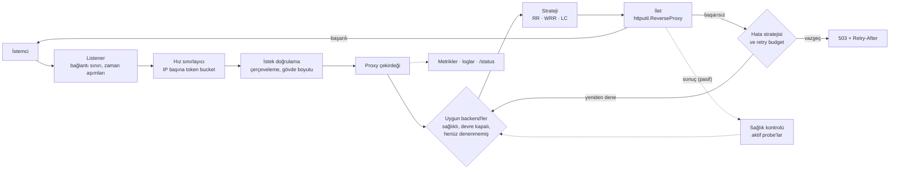
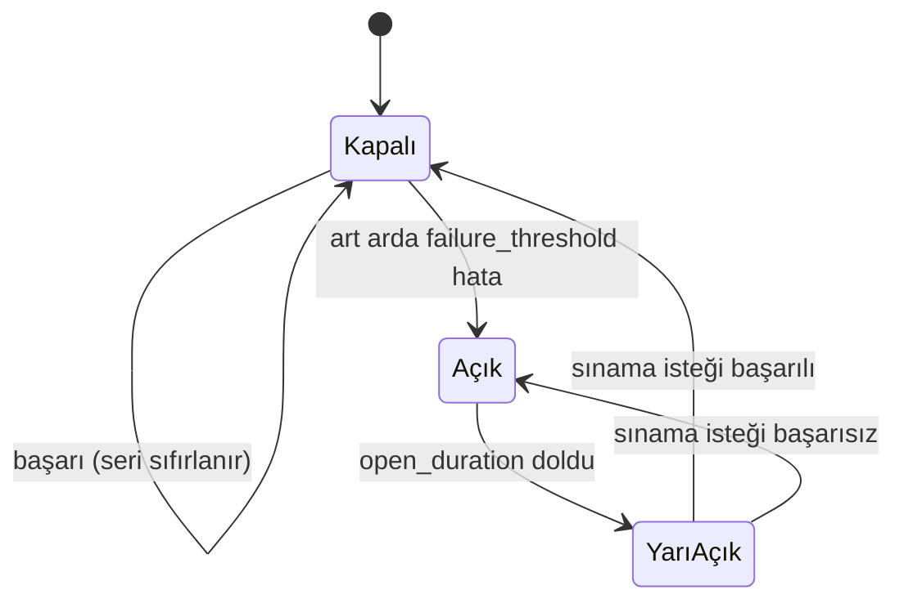

# Ege-Balancer: Go ile Modüler Bir HTTP Yük Dengeleyicinin Tasarımı ve Değerlendirmesi

**Teknik tasarım belgesi, sürüm 1.8**

| | |
| --- | --- |
| Yazar | Berk Egemen Oğuz |
| Tarih | 11 Eylül 2026 |
| Sürüm | 1.8 — v1.6'nın ve v1.7 revizyon notlarının yerini alır |
| Durum | Yayınlanan v1.0.0'ı, o günden bu yana yapılan eklemeleri ve henüz planlanan bir eklemeyi (§5.4) anlatır |
| Kod | `github.com/berkegemenoguz/ege-balancer` |
| Dil | Türkçe. Aynı içerikteki İngilizce sürüm: [technical-design-v1.8-en.md](technical-design-v1.8-en.md) |

---

## Özet

Bu belge, Go ile yazılmış ve on iki günlük bir plana göre inşa edilmiş bir HTTP ters proxy ve yük
dengeleyici olan Ege-Balancer'ın tasarımını, gerçekleştirimini ve değerlendirmesini anlatır.
Sistem üç seçim stratejisi (round robin, smooth weighted round robin ve least connections), aktif
ve pasif sağlık kontrolü, yapılandırılabilir üç hata stratejisi, istemci başına hız sınırlama,
bağlantı düşürmeden yapılandırma yenileme ve Prometheus tabanlı gözlemlenebilirlik sunar. Tasarımın
gerçekleştirim karşısında nasıl dayandığını raporluyoruz: hangi kararlar ayakta kaldı, hangileri
değişti ve neden. On çekirdekli tek bir makinede yapılan yük testi üç darboğaz ortaya çıkardı —
backend bağlantılarının yeniden kullanılmaması, doygunlukta sağlık kontrolünün havuzu boşaltması ve
istek başına 32 KB'lık bir bellek ayırma. Bunların giderilmesi 100 eşzamanlı bağlantıda
throughput'u saniyede 5.888 istekten 40.616 isteğe, yani yedi katına çıkardı ve p99 gecikmeyi
261 ms'den 7,7 ms'ye indirdi. Bu düzeltmelerden ikisi artık, düzeltme geri alınırsa başarısız olan
deterministik testlerle korunuyor. Sürümden sonra, uçuştaki retry sayısını uçuştaki isteklerin bir
payıyla sınırlayan bir retry budget ekledik; dört hatalı backend karşısında 50 eşzamanlı istek için
backend'lere ulaşan deneme sayısını 200'den 62'ye indirdi. Son olarak least connections için bir
değişikliği gerekçelendirip tanımlıyoruz — rastgele iki backend örneklemek ve daha az yüklü olanı
seçmek. Bu değişiklik, mevcut gerçekleştirimde havuzdaki ilk backend'e doğru gözlemlediğimiz bir
yanlılığı ortadan kaldırır.

---

## İçindekiler

1. [Giriş](#1-giriş)
2. [Arka plan ve ilgili çalışmalar](#2-arka-plan-ve-ilgili-çalışmalar)
3. [Hedefler ve kapsam](#3-hedefler-ve-kapsam)
4. [Sistem tasarımı](#4-sistem-tasarımı)
5. [Yük dengeleme](#5-yük-dengeleme)
6. [Hata yönetimi](#6-hata-yönetimi)
7. [Kaynak koruma ve güvenlik](#7-kaynak-koruma-ve-güvenlik)
8. [Gözlemlenebilirlik](#8-gözlemlenebilirlik)
9. [Gerçekleştirim ve süreç](#9-gerçekleştirim-ve-süreç)
10. [Değerlendirme](#10-değerlendirme)
11. [Tartışma](#11-tartışma)
12. [Sınırlar ve gelecek çalışmalar](#12-sınırlar-ve-gelecek-çalışmalar)
13. [Sonuç](#13-sonuç)
- [Kaynakça](#kaynakça)
- [Ek A — Yapılandırma referansı](#ek-a--yapılandırma-referansı)
- [Ek B — Özgün tasarımdan sapmalar](#ek-b--özgün-tasarımdan-sapmalar)
- [Ek C — Sürüm geçmişi](#ek-c--sürüm-geçmişi)

---

## 1. Giriş

Bir yük dengeleyici, istemciler ile birbirinin yerine geçebilen backend'lerden oluşan bir havuz
arasında durur. Her istek için bir backend seçmeli, isteği iletmeli ve yanıtı geri döndürmelidir;
bir backend yavaşladığında, hata verdiğinde ya da ortadan kalktığında istemcinin ne göreceğine
karar vermelidir. nginx, HAProxy ve Envoy gibi olgun proxy'ler bu kararları iyi verir, ancak
davranışları büyük kod tabanlarına ve yıllar içinde birikmiş yapılandırma seçeneklerine yayılmıştır.
Bu proje küçük bir yük dengeleyiciyi temel ilkelerden kurar: her karar yazıya dökülür, ölçülebildiği
yerde ölçülür ve değiştirilebilir tutulur.

Sistem, tek satır kod yazılmadan önce bir tasarım belgesiyle (v1.6) tanımlandı, ardından on iki
günlük bir plana göre inşa edilip v1.0.0 olarak yayınlandı. Belgenin bu sürümü planın yerine
sistemin bugünkü halini anlatır; özgün gerekçeyi geçerli kaldığı yerde korur, geçerli kalmadığı
yerde bunu kayda geçirir.

Çalışmanın katkıları şunlardır:

1. **Modüler bir tasarım:** yapılandırma, seçim, sağlık kontrolü, iletme ve gözlemlenebilirlik
   küçük arayüzlerde buluşan ayrı paketlerdir; böylece her biri tek başına test edilebilir ve
   diğerlerine dokunmadan değiştirilebilir (§4).
2. **Aşırı yük altında hata yönetiminin bir incelemesi:** özgün tasarımın atladığı iki davranış
   dahil — tamamen sağlıksız görünen havuzu reddetmek yerine yine de denemek (§6.2) ve retry'ları
   yalnızca istek başına değil tüm istekler genelinde sınırlamak (§6.5).
3. **Ölçülmüş bir değerlendirme:** üç darboğazı bulan profilli bir yük testi, her birinin
   giderilmesinin etkisi, her sıcak yolun mikro benchmark'ları ve düzeltmelerden ikisini başarısız
   olabilen testlere dönüştüren regresyon korumaları (§10).
4. **Least connections için tanımlanmış bir iyileştirme:** mevcut gerçekleştirimde gözlemlediğimiz
   bir yanlılıktan yola çıkan power of two choices (§5.4).

Belgenin geri kalanı şöyle düzenlenmiştir. §2 tasarımı mevcut çalışmalar arasına yerleştirir. §3
hedefleri ve kapsam dışını belirtir. §4-§8 sistemi anlatır. §9 nasıl inşa edildiğini anlatır. §10
değerlendirir, §11 değerlendirmenin ne anlama geldiğini tartışır, §12 sınırlarını sıralar ve §13
sonuçlandırır.

---

## 2. Arka plan ve ilgili çalışmalar

**Ters proxy'ler.** nginx [7] ve HAProxy [8], olay güdümlü ters proxy'yi HTTP servislerinin
standart ön yüzü haline getirdi; Envoy [5] zengin dayanıklılık özellikleriyle programlanabilir bir
veri düzlemi ekledi. Go'nun standart kütüphanesi `httputil.ReverseProxy`'yi [10] sunar; iletmenin
protokol ayrıntılarını — hop-by-hop başlıklar, `X-Forwarded-For`, akış — üstlenir ve yönlendirmeyi
ve politikayı çağırana bırakır. Ege-Balancer bunun üzerine kuruludur.

**Seçim stratejileri.** *Round robin* istekleri sırayla dağıtır. *Weighted round robin* bunu
yapılandırılmış ağırlıklarla orantılı yapar; nginx'in *smooth* çeşidi [7] ağır bir backend'in
sıralarını bir araya yığmak yerine araya serpiştirir. *Least connections* her isteği uçuşta en az
isteği olan backend'e gönderir ve hızı farklı backend'lere uyum sağlar; HAProxy buna `leastconn`
der [8]. En küçüğü bulmak için tüm backend'leri taramak O(n)'dir ve §5.3'te gösterildiği gibi
eşitliklerin nasıl çözüldüğüne duyarlıdır. *Power of two choices* [1, 2] rastgele iki backend
örnekler ve daha az yüklü olanı seçer: top-kutu (balls-into-bins) modelinde en yüksek yükü
Θ(log n / log log n)'den Θ(log log n)'ye indirir — ikinci bir örnekten gelen üstel bir iyileşme —
ve yük bilgisi eskidiğinde de zarifçe bozulur [3]. Envoy'un varsayılan least request dengeleyicisi
bunu kullanır [5].

**Hata yönetimi.** Sağlık kontrolü, probe'lara (aktif) ya da gerçek trafiğe (pasif) cevap
veremeyen backend'leri havuzdan çıkarır. Sağlık kontrolü *tüm* backend'leri çıkardığında Envoy'un
*panic threshold*'u yine de tüm havuza yönlendirir [5]; gerekçesi, ölü sanılan bir havuzun yalnızca
yavaş olabileceğidir. *Devre kesici* (circuit breaker) [9], tekrar tekrar başarısız olan bir
backend'e trafik göndermeyi durdurur ve bir bekleme süresinden sonra tek bir sınama isteğini
geçirir. Retry'lar geçici hataları gizler ama yükü tam da backend'ler hata verirken çoğaltır; SRE
literatürü bunları bir *retry budget* ile sınırlamayı önerir [4]. Envoy bunu aktif isteklerin bir
payı olarak [5], Finagle ise bir zaman penceresi üzerinde token bucket olarak [6] ifade eder. Dean
ve Barroso aynı gerilimi kuyruk gecikmesi tarafından ele alır [11].

**Kuyruk teorisi.** Little yasası [12] — sistemdeki ortalama istek sayısı, varış hızı ile sistemde
geçen ortalama sürenin çarpımına eşittir — §10'daki iki gözlemi açıklar: throughput doyduktan sonra
gecikmenin eşzamanlılıkla doğrusal büyümesi ve backend'ler mikrosaniyeler içinde cevap verdiğinde
least connections'ın dengeleyecek bir şeyi kalmaması.

---

## 3. Hedefler ve kapsam

### 3.1 Fonksiyonel hedefler

- Gelen HTTP isteklerini bir backend havuzuna dağıtmak.
- Yapılandırmadan seçilen üç seçim stratejisi: round robin, least connections ve weighted round
  robin.
- Aktif ve pasif sağlık kontrolü: sağlıksız bir backend'i çıkarmak, iyileşince geri almak.
- Yapılandırılabilir hata stratejileri: başka bir backend'de yeniden denemek, hemen hata dönmek ya
  da devre kesmek.
- Graceful shutdown ve bağlantı düşürmeden `SIGHUP` ile yapılandırma yenileme.
- Yapılandırılmış loglar, Prometheus metrikleri ve insanın okuyabileceği bir durum ucu.

### 3.2 Hedef ortam

Tek makinede, birkaç backend sürecinin önünde çalışan küçük-orta ölçekli bir yük dengeleyici.
Referans ortam tek bir geliştirici makinesinde Docker Compose ile çalışır: on mock backend, yük
dengeleyici, Prometheus ve Grafana. "Production'a hazır" ifadesi gerçek bir sunucuya taşınmaya hazır
olmayı anlatır — küçük, root olmayan bir imaj, sağlık uçları, graceful shutdown, CI — bir dağıtımın
var olduğunu değil.

### 3.3 Kapsam dışı

- TLS sonlandırma, HTTP/2 ve gRPC.
- Dağıtık ya da çok düğümlü dengeleme ve servis keşfi.
- Sticky session: backend'lerin durumsuz olduğu varsayılır.
- Elle yazılmış bir epoll olay döngüsü. Özgün tasarım bunu opsiyonel bir öğrenme egzersizi olarak
  planlamıştı; yapılmadı ve sistemde hiçbir şey ona bağlı değil (§4.3).

---

## 4. Sistem tasarımı

### 4.1 Mimari

Bir istek sabit bir zincirden geçer. Listener bağlantıyı bir bağlantı sınırı altında kabul eder;
hız sınırlayıcı ve istek doğrulama onu reddedebilir; proxy çekirdeği sağlıklı ve devresi kapalı
olanlar arasından bir backend seçer, isteği iletir ve deneme başarısız olursa hata stratejisini
uygular. Sağlık kontrolü zincirin yanında çalışıp onu besler; metrikler onu gözlemler.



*Şekil 1 — İsteğin yolu. Düz oklar isteği, noktalı oklar isteğe giren ve ondan çıkan durumu
gösterir.*

### 4.2 Paketler ve arayüzler

```
cmd/lb/                    giriş noktası: yapılandırmayı okur, logger'ı kurar, uygulamayı çalıştırır
cmd/demo/                  demo ortamını yönetmek için yerel konsol (imaja dahil değil)
internal/app/              kurulum (wiring); binary ve entegrasyon testleri ortak kullanır
internal/config/           ayrıştırma, varsayılanlar, doğrulama, yenileme kuralları
internal/balancer/         Backend, LBStrategy arayüzü ve üç strateji
internal/health/           aktif ve pasif sağlık kontrolü
internal/proxy/            iletme, hata stratejileri, retry budget, hız sınırlama, doğrulama
internal/server/           listener'lar, bağlantı sınırı, graceful shutdown
internal/observability/    yapılandırılmış loglama, Prometheus metrikleri, /status, pprof
internal/integration/      gerçek soketler üzerinde uçtan uca testler
```

Kurulum `main` yerine `internal/app` içinde durur; böylece entegrasyon testleri binary'nin çalıştırdığı
zincirin tam kendisini kurar. `cmd/lb/main.go` yalnızca yapılandırmayı okur, logger'ı kurar ve
`app.New`'u çağırır. Paketler iki arayüzde buluşur:

```go
// internal/balancer
type LBStrategy interface {
    Select(backends []*Backend) (*Backend, error)
    Name() string
}

// internal/health
type Checker interface {
    Start(ctx context.Context, backends []*Backend)
    IsHealthy(addr string) bool
    ReportSuccess(addr string)
    ReportFailure(addr string)
    Reload(ctx context.Context, cfg config.HealthCheck, backends []*Backend)
}
```

Bir `Backend` adresini ve iki atomik değeri taşır: ağırlığını — istekler üzerinde dengelenirken bir
yenileme onu değiştirebilir — ve least connections'ın okuduğu uçuştaki istek sayısını. Sağlık
bilinçli olarak `Backend`'in bir alanı *değildir*: adrese göre checker'da tutulur; böylece aktif ve
pasif kontrol aynı sayaçları besler ve sağlık durumu havuz yeniden kurulduğunda korunur.

### 4.3 Eşzamanlılık modeli

Her bağlantı kendi goroutine'inde işlenir; kod senkron yazılırken Go runtime'ının netpoller'ı
soketleri Linux'ta epoll üzerinden çoklar. Özgün tasarım, öğrenme amacıyla bir epoll döngüsünün elle
yazılacağı ikinci, opsiyonel bir aşama öneriyordu; değerlendirme (§10.2) kalan CPU profilinin sistem
çağrılarının hakimiyetinde olduğunu ve yük dengeleyicinin kendi kodunda sıcak nokta kalmadığını
gösterdi. Bu da ona dönmek için performans açısından bir neden bırakmıyor.

Paylaşılan durum, nasıl kullanıldığına göre korunur:

| Durum | Koruma | Neden |
| --- | --- | --- |
| Round robin konumu | tek bir atomik sayaç | seçim başına tek bir artırım |
| Backend başına uçuştaki istek | `Backend` üzerinde atomik sayaç | least connections okur, her istek yazar |
| Backend ağırlığı | `Backend` üzerinde atomik | okunurken yenileme ile değişir (§11.1) |
| Weighted round robin kredisi | mutex | tüm havuz üzerinde oku-değiştir-yaz |
| Sağlık durumu | checker'da read-write mutex | her istekte okunur, probe'lar ve raporlar yazar |
| Devre durumu | breaker'da mutex | küçük; backend hata verirken yazma ağırlıklı |
| İletme ayarları | değişmez bir anlık görüntüye `atomic.Pointer` | yenilemede bütünüyle değiştirilir |
| Retry budget | iki atomik sayaç | her istekte; kilitsiz (§6.5) |

### 4.4 Yapılandırma ve yenileme

Yapılandırma, katı biçimde çözülen bir YAML dosyasıdır — bilinmeyen bir alan hatadır — ardından
varsayılanlar uygulanır ve doğrulanır. Doğrulama ilk sorunu değil tüm sorunları birlikte raporlar.
Tam şema Ek A'dadır.

`SIGHUP` geldiğinde dosya yeniden okunur ve doğrulanır. Geçersizse hiçbir şey değişmez; hata
loglanır ve sayılır. Geçerliyse iletme ayarları yeni ve değişmez bir anlık görüntü olarak yeniden
kurulur ve tek bir atomik yazımla yayınlanır. Bir istek anlık görüntüyü başlarken bir kez okur ve
sonuna kadar onu kullanır; böylece bir yenileme hiçbir isteği yeni havuz ile eski hata stratejisi
arasında bırakamaz. Yenilemeden sağ çıkan backend'ler `Backend` nesnelerini — dolayısıyla uçuştaki
istek sayılarını — ve sağlık serilerini korur. Bir sokete bağlı ayarlar (`listen_addr`,
`metrics_addr`, `max_connections`, zaman aşımları, `enable_pprof`) servis sırasında değişemez;
yenileme geri kalan her şeyi uygular ve bunlardan hangilerine dokunmadığını loglar.

---

## 5. Yük dengeleme

Tüm stratejiler `LBStrategy`'yi gerçekler. Proxy çekirdeği önce havuzu sağlıklı, devresi kapalı ve
bu isteğin henüz denemediği backend'lere daraltır; strateji bunlar arasından seçer. Filtrelemenin
stratejilerin dışında tutulması, her stratejiyi kendisine verilen havuzun saf bir fonksiyonu olarak
bırakır.

### 5.1 Round robin

Her seçimde tek bir atomik sayaç artırılır ve havuz boyutuna göre modu alınır. Seçim O(1) ve
kilitsizdir. Backend'ler eşit olduğunda doğru seçimdir ve kesindir: on backend üzerinde, onun katı
sayıda istek eşit bölünür.

### 5.2 Smooth weighted round robin

Özgün tasarım ağırlıklı seçimi olasılıksal olarak tanımlıyordu. Gerçekleştirim bunun yerine nginx'in
deterministik smooth weighted round robin'ini [7] kullanır. Her seçimde:

1. her backend'in kredisi ağırlığı kadar artırılır;
2. en yüksek krediye sahip backend seçilir;
3. onun kredisi tüm ağırlıkların toplamı kadar azaltılır.

Sonuç, yapılandırılan oranı ortalamada değil tam olarak tutturur ve ağır bir backend'in sıralarını
döngüye yayar: 5, 1, 1 ağırlıkları `a a a a a b c` yerine `a a b a c a a` üretir. Rastgelelik kaynağı
olmadığından testler istatistiksel değil kesindir — 1, 2 ve 3 ağırlıkları üzerinde 1.200 istek tam
olarak 200, 400 ve 600'e bölünür. Kredi adrese göre tutulur; böylece backend'ler havuzdan çıkıp geri
döndükçe stratejiye sunulan havuz değişse de anlamını korur. Bedeli, bir mutex altında havuzun
taranmasıdır: seçim başına O(n) (§10.4).

### 5.3 Least connections

Her istek, iletilmeden önce backend'inin uçuştaki istek sayacını artırır ve bittiğinde — retry'lar
dahil — azaltır. Least connections havuzu tarar ve sayısı en düşük olan backend'i döndürür;
eşitlikte havuzdaki ilk backend seçilir.

Hızı farklı backend'lere uyum sağlar; entegrasyon testleri bunu gösterir: bir yavaş ve iki hızlı
backend ile 60 eşzamanlı istekten yavaş olan 16, hızlı ikili 44 istek aldı. İki zayıflığı vardır ve
ikisi de bu projede görüldü:

- **İlk backend'e doğru bir yanlılık.** Backend'ler istekler geldiğinden daha hızlı cevap verdiğinde
  eşitlikler sık olur. Little yasasına göre saniyede 20 istek ve istek başına bir milisaniyede
  uçuştaki ortalama istek sayısı 0,02'dir; yani neredeyse her seçim tüm sayaçları sıfır görür ve ilk
  backend'i seçer. On eşit backend ile gerçek soketler üzerinde ölçüldüğünde 100 ardışık isteğin
  tamamı `backend-1`'e gitti; 100 eşzamanlı istekten ona 16, diğerlerinin her birine 7 ile 14
  arasında düştü.
- **Sürü davranışı (herding).** Birlikte gelen istekler, hiçbiri sayacı artırmadan önce aynı
  sayaçları okur ve hepsi aynı backend'i seçer.

Seçim ayrıca O(n)'dir: on backend üzerinde 4,2 ns, yüz backend üzerinde 44 ns (§10.4). Bu maliyet
iletmenin yanında küçüktür, ama hiçbir fayda sağlamadan havuzla birlikte büyür.

### 5.4 Power of two choices (planlanan)

> **Durum:** bu sürümde tanımlandı; v1.1.0 için gerçekleştirilecek ve değerlendirilecek. §10.7
> geçmesi gereken değerlendirmeyi belirtir. Bu bölümdeki hiçbir şey henüz ölçülmüş bir sonuç
> değildir.

**Algoritma.** n backend'lik bir havuz için:

- n = 0: backend yok (bugünkü gibi 503);
- n = 1: o backend;
- n ≥ 2: rastgele ve düzgün dağılımlı iki *farklı* indeks çek, iki backend'in uçuştaki istek
  sayılarını karşılaştır, düşük olanı döndür; eşitlikte ilk çekileni döndür.

Farklı indeksler `i = rand(n)`, `j = rand(n−1)` ve `j ≥ i` ise `j++` biçiminde çekilir; tekrar
döngüsü gerekmez. n = 2 iken iki örnek havuzun tamamıdır, dolayısıyla seçim tam olarak least
connections'tır. Strateji, Envoy'un least request dengeleyicisinin yaptığı gibi yapılandırmadaki
`least_connections` adını korur; yapılandırmalar değişmez.

**§5.3'teki sorunları neden çözer.**

- *Yanlılık ortadan kalkar.* Tüm sayılar eşit olduğunda seçim, her zaman ilk backend yerine, iki
  rastgele çekilişin ilkidir — havuz üzerinde düzgün dağılımlı.
- *Sürü davranışı azalır.* Eşzamanlı istekler farklı çiftler örnekler; aynı sayaçları okusalar bile
  dağılırlar. Bu, Mitzenmacher'ın eskimiş yük bilgisi analizinin [3] ortamıdır: orada iki seçenek
  örneklemek etkili kalırken, eski bilginin küresel en küçüğünü seçmek kötü davranır.
- *Yük dengeli kalır.* Top-kutu modelinde iki seçenekle en yüksek yük, tek rastgele seçimdeki
  Θ(log n / log log n)'e karşı Θ(log log n)'dir [1, 2]; ikinci örnek, tam taramanın faydasının
  neredeyse tamamını sağlar.
- *Seçim O(1) olur:* havuz boyutu ne olursa olsun iki rastgele sayı ve iki atomik okuma.

**Rastgelelik ve testler.** Strateji, eşzamanlı kullanım için güvenli olan ve çağırandan kilit
gerektirmeyen `math/rand/v2` üst düzey fonksiyonlarından çeker. Deterministik testler özgün
gerçekleştirimin bir ilkesiydi (§5.2); bunu korumak için rastgele indeks kaynağı stratejinin bir
alanıdır ve birim testlerinde tohumlanmış bir üreteçle kurulur, böylece başarısız bir test yeniden
üretilebilir.

**Neler değişmez.** Filtreleme (sağlık, devre, daha önce denenmiş olma) stratejiden önce yapılır;
dolayısıyla bir örnek hiçbir zaman uygun olmayan bir backend'e düşemez. Weighted round robin ve
round robin etkilenmez.

---

## 6. Hata yönetimi

### 6.1 Sağlık kontrolü

*Aktif* kontrol her `interval`'de her backend'in `health_check.path` yolunu kendi `timeout`'u ile
yoklar. *Pasif* kontrolü proxy yürütür ve her denemenin sonucunu bildirir. İkisi de backend başına
tek bir ardışık sonuç sayacı çiftini besler: art arda `unhealthy_threshold` başarısızlık onu
çıkarır, art arda `healthy_threshold` başarı geri alır. Böylece bir backend, bir sonraki probe'u
beklemeden, gerçek trafik onda başarısız olur olmaz havuzdan çıkar. Backend'ler sağlıklı başlar ki
trafik ilk probe tamamlanmadan akabilsin; checker'ın tanımadığı bir adres sağlıklı sayılır.

### 6.2 Tamamen sağlıksız bir havuz yine de denenir

Özgün tasarım, sağlık kontrolü tüm backend'leri çıkardığında ne yapılacağını söylemiyordu. Yük testi
bunu cevapladı: doygunlukta probe'lar zaman aşımına uğrayan ilk istekler arasındaydı, tüm backend'ler
aynı anda sağlıksız işaretlendi — 172 çıkarma ve bunlarla eşleşen 172 geri dönüş — ve yük dengeleyici,
gerçekte hiçbir şey çökmemişken 275.769 isteği reddetti. Yavaş bir sistem bozuk bir sisteme dönmüştü.

Havuzda uygun hiçbir şey kalmadığında istek artık yine de denenmemiş backend'lere sunulur ve bu geri
düşüş `no_healthy_backend` olarak sayılır. Bu, Envoy'un panic mode'udur [5]. Hâlâ cevap
verebilecek bir backend bir denemeye değer; gerçekten ölü olan bir başarısız denemeye mal olur ve
ardından istemci zaten alacağı 503'ü alır. Gözlemlenebilir sonucu: tüm backend'ler sağlıksız ama
hâlâ cevap verir durumdayken istemci backend'in kendi yanıtını alır.

### 6.3 Hata stratejileri

Başarısız bir deneme; reddedilen ya da zaman aşımına uğrayan bir bağlantı, `response_timeout`
içinde cevap vermeye başlamayan bir backend ya da — yalnızca `retry_on_5xx` açıksa — bir 5xx
yanıttır.

| Strateji | Başarısız bir denemede davranış |
| --- | --- |
| `retry_next_backend` | bu isteğin henüz denemediği başka bir backend'i, en fazla `max_retries` kez ve retry budget dahilinde dener (§6.5) |
| `fail_fast` | istemciye hemen yanıt verir |
| `circuit_breaker` | istemciye hemen yanıt verir ve hatayı backend'in devresini açmaya doğru sayar |

Bir retry, aynı istek içinde hiçbir zaman bir backend'i tekrar etmez. Yeniden gönderilebilmesi için
istek gövdesi, retry mümkün olduğunda `max_request_body_bytes`'a kadar tamponlanır; tek denemede
doğrudan akıtılır.

### 6.4 Devre kesici



*Şekil 2 — Bir backend'in devresi. Açık durumdayken ve yarı açık sınama isteği uçuştayken backend
seçimden çıkarılır.*

Devre kesici sağlık kontrolünden bağımsızdır: sağlık, bir backend'in probe'lara cevap verip
vermediğini; devre ise gerçek trafikte hata verip vermediğini yansıtır. Sınama isteği olarak tam bir
istek geçirilir; diğer her şey onun sonucunu bekler.

### 6.5 Retry budget

`max_retries` bir isteğin retry'larını sınırlar, istekler genelindeki retry'ları sınırlamaz: bir
havuz hata vermeye başladığında her istek aynı anda yeniden dener ve backend'lere ulaşan trafik
1 + `max_retries` katına kadar büyür — tam da en az kaldırabilecekleri anda. Bu, SRE literatürünün
uyardığı retry fırtınasıdır [4].

Bu yüzden yük dengeleyici, Envoy'u [5] izleyerek bir budget tutar. Uçuştaki istekleri ve uçuştaki
retry'ları sayar ve bir retry'a yalnızca şu koşul sağlanırken izin verir:

```
uçuştaki_retry < max(min_retry_concurrency, budget_percent × uçuştaki_istek)
```

Varsayılanlar %20 ve 3'tür. Alt sınır, yükün %20'sinin sıfıra yuvarlandığı hafif trafikte
retry'ları mümkün tutar. Budget'ın reddettiği retry gönderilmez: istemci `Retry-After` ile 503
alır ve ret `retry_budget_exhausted` olarak sayılır.

Bu modeli Finagle'ın token bucket'ına [6] tercih ettik, çünkü ayarlanacak bir zaman penceresi ya da
dolum hızı yoktur, yükü her an izler ve iki atomik sayaçla, kilitsiz çalışır. Budget, yapılandırma
anlık görüntüsüne aittir: bir yenileme yeni ve boş bir budget kurar, uçuştaki istekler başladıkları
budget'ı korur; böylece hiçbir sayaç yanlış örnek üzerinde azaltılmaz. Budget varsayılan olarak
açıktır; ondan söz etmeyen bir yapılandırma varsayılanları alır ve hafif trafik tam olarak eskisi
gibi retry yapar.

### 6.6 İstemcinin gördüğü

| Durum | Yanıt | Ret nedeni |
| --- | --- | --- |
| İstemci başına hız aşıldı | 429, `Retry-After: 1` | `rate_limited` |
| Belirsiz çerçeveleme (iki `Content-Length` ya da `Content-Length` ile `Transfer-Encoding`) | 400 | `bad_framing` |
| `max_request_body_bytes`'ı aşan gövde | 413 | `body_too_large` |
| Tüm denemeler başarısız ya da denenecek backend yok | 503, `Retry-After: 5` | `no_backend_available` |
| Budget'ın reddettiği retry | 503, `Retry-After: 5` | `retry_budget_exhausted` |
| Backend 5xx döndü, `retry_on_5xx: false` | backend'in kendi yanıtı | — |
| Tüm backend'ler sağlıksız ama cevap veriyor | backend'in kendi yanıtı | `no_healthy_backend` (sayılır, reddedilmez) |

---

## 7. Kaynak koruma ve güvenlik

Bu sürümde güvenlik, ağır bir katmandan çok, ucuz ama etkisi büyük önlemlerden oluşur.

- **Bağlantı sınırı.** Trafik listener'ı `max_connections`'ın ötesindeki bağlantıları reddeder.
  Gözlemlenebilirlik sunucusunda sınır yoktur; böylece tam da trafik portu dolduğunda cevap vermeye
  devam eder.
- **Her aşamada zaman aşımı.** Bağlantı, yanıt, okuma, yazma ve boşta kalma sürelerinin her birinin
  bir sınırı vardır; yavaş bir istemci ya da backend kaynakları süresiz tutamaz.
- **İstemci başına hız sınırlama.** İstemci adresi başına bir token bucket; saniyede
  `rate_limit_per_ip` kadar dolar ve aynı büyüklükte bir patlamaya izin verir. Adres, istemcinin
  taklit edebileceği bir başlık değil, soketin karşı ucudur. 10.000 istemci izlendiğinde on dakika
  boşta kalan bucket'lar süpürülür; böylece tek seferlik istemciler belleği sınırsız büyütemez. Bir
  yenileme, bucket'ları sıfırlamadan hızı değiştirir.
- **Request smuggling.** Gövde çerçevelemesi iki farklı biçimde okunabilecek istekler, bir backend
  onları görmeden RFC 9112'yi [13] izleyerek reddedilir (§6.6). Go'nun sunucusu en açık durumları
  zaten reddeder; kontrol, proxy buna bağımlı olmasın diye tekrarlanır.
- **Yönlendirme başlıkları.** `X-Forwarded-For` ve ilgili başlıklar eklenmez, yeniden yazılır;
  böylece bir istemci backend'in göreceği adresi taklit edemez.
- **Ayrı gözlemlenebilirlik portu.** `/metrics`, `/status` ve opsiyonel pprof uçları trafik portunda
  değil, `metrics_addr` üzerinde sunulur. pprof, heap ve goroutine durumunu açığa çıkardığı için
  varsayılan olarak kapalıdır.
- **Tedarik zinciri ve imaj.** CI her push'ta `govulncheck` çalıştırır. İmaj iki aşamada derlenir ve
  `distroless/static:nonroot` üzerinde çalışır — 22,6 MB, kabuk yok, paket yöneticisi yok, root
  olmayan kullanıcı.

---

## 8. Gözlemlenebilirlik

### 8.1 Metrikler

| Metrik | Tür | Etiketler | Anlamı |
| --- | --- | --- | --- |
| `lb_requests_total` | counter | backend, status | bir backend'in cevapladığı istekler |
| `lb_request_duration_seconds` | histogram | backend | yük dengeleyicide ölçülen servis süresi |
| `lb_backend_failures_total` | counter | backend | bir backend'in karşılayamadığı denemeler |
| `lb_retries_total` | counter | — | gönderilen retry'lar |
| `lb_rejected_requests_total` | counter | reason | yük dengeleyicinin kendisinin reddettiği istekler (§6.6) |
| `lb_config_reloads_total` | counter | result | uygulanan ya da reddedilen yenilemeler |
| `lb_backend_active_connections` | gauge | backend | uçuştaki istekler, scrape anında okunur |
| `lb_backend_healthy` | gauge | backend | 1 sağlıklı, 0 değil; scrape anında okunur |

İki gauge, ayrı değişkenlere kopyalanmak yerine Prometheus scrape ettiğinde canlı durumdan okunur;
böylece zamanla sapabilecek ikinci bir kopya yoktur.

### 8.2 Durum, loglar ve profilleme

`/status` bir scraper'a değil bir insana cevap verir: algoritma, sağlıklı backend sayısı, uygulanan
yenileme sayısı ve her backend'in ağırlığı, sağlığı ve uçuştaki istek sayısı. Loglar `log/slog`
üzerinden yapılandırılmış JSON (ya da metin) olarak yazılır. Etkinleştirildiğinde `/debug/pprof`
metrik portunda sunulur.

### 8.3 İzleme yığını

Compose ortamı, beş saniyede bir scrape eden Prometheus'u ve hazır bir dashboard'lu Grafana'yı
çalıştırır: backend başına istek oranı, hata ve ret oranları, gecikme yüzdelikleri, backend başına
uçuştaki istekler, sağlık ve budget retlerine karşı retry'lar. Bu yığını çalıştırmaktan çıkan iki
kaynak bulgusu Ek B'de (7. madde) kayıtlıdır: Grafana daha yüksek bir sınır yerine bir Go bellek
bütçesine (`GOMEMLIMIT`) ihtiyaç duyar; Prometheus 256 MB'a sığar.

---

## 9. Gerçekleştirim ve süreç

### 9.1 Plan ve nasıl gerçekleşti

| Gün | Planlanan | Teslim edilen |
| --- | --- | --- |
| 1 | Proje kurulumu, mock ortam | repo iskeleti, CI, on `http-echo` backend |
| 2 | Yapılandırma modülü | katı YAML ayrıştırma, varsayılanlar, tüm sorunları raporlayan doğrulama |
| 3 | Listener ve proxy çekirdeği | bağlantı sınırlı listener, graceful shutdown, iletme |
| 4 | Round robin | `LBStrategy`, round robin |
| 5 | Least connections, weighted round robin | uçuştaki istek sayaçları, *smooth* weighted round robin |
| 6 | Sağlık kontrolü | ortak sayaçlar üzerinde aktif ve pasif kontrol |
| 7 | Proxy çekirdeğinin tamamlanması | doğrulama, hız sınırlama, zaman aşımları, hata stratejileri, devre kesici |
| 8 | Loglama ve metrikler | slog, Prometheus, `/status`, Prometheus ve Grafana yığını |
| 9 | Entegrasyon testleri | gerçek soketler üzerinde uçtan uca test paketi |
| 10 | Yük testi ve profilleme | üç darboğaz bulundu ve giderildi; performans raporu |
| 11 | Dayanıklılık ve yenileme | hata senaryoları doğrulandı, `SIGHUP` ile yenileme, yanıt zaman aşımı |
| 12 | Production hazırlığı, sürüm | distroless imaj, release workflow'u, dağıtım kontrol listesi, v1.0.0 |

10. ve 11. günlerin yanında planlanan opsiyonel epoll egzersizi yapılmadı (§4.3).

### 9.2 İş akışı

Özgün tasarım korumalı bir `main`, feature dalları ve pull request'ler öngörüyordu. Tek geliştirici
ve incelemeci olmadığında bu, kalite kapısı olmadan süreç yükü ekler; bu yüzden çalışma doğrudan
`main`'e commit edilir ve kapı CI'dır: her push gofmt, `go vet`, golangci-lint, govulncheck,
derleme, race detector altında tüm test paketi ve imaj derlemesini çalıştırır. Bir `vX.Y.Z` etiketi
release workflow'unu tetikler; bu, testleri yeniden çalıştırır, imajı derler, onu etiket ve `latest`
olarak gönderir ve sürüm notlarını yayınlar. Commit mesajları Conventional Commits'e uyar. Bir ekip
oluşursa pull request akışı yeniden açılabilir; CI, onun ihtiyaç duyacağı her şeyi zaten çalıştırır.

İkinci bir workflow her push'ta benchmark'ları çalıştırır, aynı runner'da push'tan önceki kod üzerinde
yeniden çalıştırır ve benchstat [14] karşılaştırmasını çalışma özetine yazar. Yalnızca raporlar,
hiçbir zaman başarısız olmaz: paylaşılan runner'larda zamanlamalar aynı çalıştırmalar arasında
yüzde birkaç oynar.

### 9.3 Test

Test paketi, 25'i birleştirilmiş yük dengeleyiciyi gerçek soketlerde başlatan entegrasyon testi
olmak üzere 131 test fonksiyonu ve 10 benchmark içerir. Paket bazında birim test kapsamı:

| Paket | Kapsam |
| --- | --- |
| `balancer` | %100,0 |
| `observability` | %98,8 |
| `health` | %97,9 |
| `proxy` | %94,3 |
| `config` | %90,3 |
| `server` | %83,7 |

Entegrasyon testleri yapılandırmalarını bir dosyaya yazar ve binary ile aynı yoldan yükler; böylece
varsayılanlar ve doğrulama da diğer her şeyle birlikte sınanır.

---

## 10. Değerlendirme

### 10.1 Yöntem

| | |
| --- | --- |
| Makine | Apple silicon, 10 çekirdek, macOS |
| Yük dengeleyici | tek süreç, `GOMAXPROCS` varsayılan |
| Backend'ler | tek süreçte on basit HTTP sunucusu, on baytlık gövde |
| Yapılandırma | round robin, iki retry'lı `retry_next_backend`, hız sınırlama kapalı, `max_connections: 10000` |
| Süre | seviye başına on saniye, bağlantılar boyunca açık tutuldu |

Yük üreteci, backend'ler ve yük dengeleyici aynı makineyi paylaşır; bu yüzden mutlak sayılar bir
alt sınırdır. Anlamı çalıştırmalar arası karşılaştırmalar taşır, çünkü her çalıştırma aynı dezavantajı
paylaşır. Referans ölçümleri `ab` üretti, ancak `ab` tek thread'lidir ve bin bağlantıda
başarısız oldu (`apr_socket_recv: Operation timed out`). Bunun üzerinde amaca özel bir sürücü
kullanıldı — bağlantı başına bir goroutine, keep-alive, istek başına gecikme kaydı. Sayıların üreteci
değil yük dengeleyiciyi anlattığını doğrulamak için sürücü önce doğrudan bir backend'e karşı
saniyede 108.000 istekle denendi.

### 10.2 Darboğazlar

İlk çalıştırma backend'lerin tek başına verdiğinden çok daha kötüydü: 100 bağlantıda saniyede
5.888 istek, p99 261 ms ve %6 hata; 1.000 bağlantıda her istek başarısız oldu.

**Backend bağlantıları yeniden kullanılmıyordu.** CPU profili zamanın %93'ünü sistem çağrılarında,
%2'sini yük dengeleyicinin kendi mantığında gösterdi; log `connect: can't assign requested
address` diyordu ve binin üzerinde soket `TIME_WAIT`'teydi. Go'nun varsayılan transport'u host başına
iki boşta bağlantı tutar; yük altında neredeyse her istek yeni bir bağlantı açtı ve geçici port
aralığı tükendi. Boşta bağlantı havuzu artık yapılandırmadan boyutlandırılır: toplamda
`max_connections`, backend'lere en az 32'şer olmak üzere bölünür.

**Sağlık kontrolü havuzu boşaltıyordu.** Bağlantılar yeniden kullanılınca doygunluk probe'ları zaman
aşımına uğrattı ve tüm backend'ler aynı anda çıkarıldı (§6.2). Denenmemiş havuza geri düşüş bunu
çözdü.

**İstek başına 32 KB bellek ayırma.** Heap profili tüm bellek ayırmanın %80,8'ini `ReverseProxy`'nin
kopyalama tamponuna bağladı: yirmi saniyelik bir çalıştırmada 56 GB, canlı heap ise yalnızca 22 MB
— bir sızıntı değil, çöp toplayıcı üzerinde baskı. `sync.Pool` destekli bir tampon havuzu bunu
kaldırdı.

| Değişiklik | Bağlantı | Önce | Sonra |
| --- | --- | --- | --- |
| Yeniden kullanılan backend bağlantıları | 100 | 5.888 istek/sn, p99 261 ms, %6 hata | 28.431 istek/sn, p99 10 ms, hatasız |
| Yeniden kullanılan backend bağlantıları | 1.000 | her istek başarısız | 35.075 istek/sn |
| Tampon havuzu | 500 | 32.147 istek/sn, p99 41,4 ms | 41.829 istek/sn, p99 32,4 ms |

### 10.3 Sonuçlar

| Bağlantı | Throughput | p50 | p95 | p99 | max |
| --- | --- | --- | --- | --- | --- |
| 100 | 40.616 istek/sn | 2,1 ms | 5,3 ms | 7,7 ms | 26,7 ms |
| 500 | 41.829 istek/sn | 11,2 ms | 24,0 ms | 32,4 ms | 147,5 ms |
| 1.000 | 41.208 istek/sn | 23,6 ms | 46,7 ms | 60,2 ms | 122,5 ms |
| 2.000 | 41.421 istek/sn | 47,3 ms | 87,5 ms | 106,6 ms | 712,6 ms |

Hiçbir seviyede istek başarısız olmadı. Throughput 100 bağlantıdan itibaren, paylaşılan makinenin
doyduğu yaklaşık saniyede 41.000 istekte düzdür; ardından gecikme, doymuş bir sunucu için Little
yasasının öngördüğü gibi eşzamanlılıkla orantılı büyür [12]. Başlangıca göre 100 bağlantıda
throughput yedi katına çıktı ve p99 261 ms'den 7,7 ms'ye düştü.

Özgün tasarım bin bağlantıda p95'i "tek haneli ya da düşük onlu milisaniyeler" olarak koymuştu.
Üreteci ve on backend'in tamamını da çalıştıran bir makinede ölçüm 46,7 ms'dir; 100 bağlantıda p95
5,3 ms'dir. Hedefi tek bir sayı olarak değil, beklenen yük cinsinden yeniden ifade ediyoruz (Ek B,
10. madde). Kalan profil sistem çağrılarının hakimiyetindedir; bu, çoğunlukla bayt taşıyan bir proxy
için beklenen şekildir. Daha fazla kazanç yük dengeleyicinin kodundan değil, işletim sisteminden ve ağ
yığınından gelir.

### 10.4 Mikro benchmark'lar

| Benchmark | İşlem başına süre | Bellek ayırma |
| --- | --- | --- |
| Round robin, 10 ve 100 backend | 1,9 ns, 1,8 ns | yok |
| Least connections, 10 ve 100 backend | 4,2 ns, 44 ns | yok |
| Weighted round robin, 10 ve 100 backend | 177 ns, 1,95 µs | yok |
| 10 goroutine ile RR, LC, WRR | 36 ns, 1,2 ns, 274 ns | yok |
| Sağlık sorgusu, tek başına ve raporlarla birlikte | 7,6 ns, 35 ns | yok |
| Hız sınırlayıcı, tek istemci ve çok istemci | 12 ns, 102 ns | yok |
| Retry budget, tek başına ve 10 goroutine ile | 3,5 ns, 144 ns | yok |
| Tek bir isteği iletmek, sıralı ve paralel | 32 µs, 11 µs | 13 KB, 104 |

Seçim, iletmenin yanında ucuzdur: en yavaş durum olan yüz backend üzerinde weighted round robin,
tek bir isteği iletmenin maliyetinin yaklaşık %6'sıdır. Weighted round robin ve least connections
havuzla doğrusal büyür; round robin büyümez. Round robin tek başına en hızlı stratejidir ama on
goroutine ile yirmi kat yavaşlar, çünkü hepsi tek bir sayacı artırır ve onu tutan cache line
çekirdekler arasında gidip gelir. İstek yolunda iletmenin kendisi dışında hiçbir şey bellek ayırmaz.

### 10.5 Regresyon korumaları

Yük testi tüm ortama ve sessiz bir makineye ihtiyaç duyar; bu yüzden her değişiklikte çalışamaz.
Zararsız görünen bir düzenlemenin geri alabileceği iki düzeltmenin her biri, olağan test paketinde
deterministik bir teste sahiptir:

| Koruma | Ölçtüğü | Sağlıklı | Düzeltme geri alınınca |
| --- | --- | --- | --- |
| Bağlantı yeniden kullanımı | 24 eşzamanlı isteklik 5 turun açtığı backend bağlantıları (sınır 48) | 24 | 112, başarısız |
| Bellek ayırma bütçesi | iletilen istek başına ayrılan bayt (sınır 32 KB) | yaklaşık 13 KB | yaklaşık 46 KB, başarısız |

İkisi de özgün hata geri getirilerek doğrulandı. İkincisi bellek ayırma sayısına değil bayta göre
karar verir, çünkü sayı her iki durumda da 104'tür: eksik havuz ayırmaların sayısını değil,
birinin boyutunu değiştirir.

### 10.6 Bir retry fırtınası altında retry budget

Her biri 100 ms sonra 500 döndüren dört backend, 50 eşzamanlı istek, istek başına en fazla üç retry,
`retry_on_5xx` açık:

| Budget | Backend'lere ulaşan deneme |
| --- | --- |
| Yükün tamamı (%100) | tam olarak 200 — her istek dört kez denendi; 150 retry gönderildi |
| Varsayılan (%20, bu testte alt sınır 1) | 10 çalıştırmanın her birinde ve iki CPU'da 20 çalıştırmanın daha her birinde 62 |

Retry'lar hatalı havuz üzerindeki yükü budget olmadan dört katına, budget ile 1,24 katına çıkardı.
Budget tek başına 3,5 ns, on goroutine yarışırken 144 ns tutar — paralel olarak bir isteği iletmenin
yaklaşık %1'i — ve iletmenin kendisi 104 bellek ayırma ve yaklaşık 13 KB'ta değişmeden kaldı.

### 10.7 Power of two choices için planlanan değerlendirme

§5.4'te tanımlanan değişiklik, v1.1.0 için ancak aşağıdakilerin tamamını karşılarsa kabul edilir. Her
ölçüt, mevcut tam tarama gerçekleştirimine karşı ölçülür.

| | Hipotez | Ölçüm | Kabul |
| --- | --- | --- | --- |
| E1 | Seçim maliyeti artık havuzla büyümüyor | 10, 100 ve 1.000 backend'de `BenchmarkSelect` | havuz boyutları arasında seçim süresi gürültü sınırında; bellek ayırma yok |
| E2 | İlk backend yanlılığı ortadan kalktı | 10 boşta backend üzerinde 10.000 seçim ve §5.3'teki 100 ardışık istek | her backend eşit payın ±%20'si içinde; tam tarama ilk backend'e %100 verir |
| E3 | Yavaş backend'lerden hâlâ kaçınılıyor | mevcut entegrasyon testi: bir yavaş ve iki hızlı backend, 60 eşzamanlı istek | yavaş backend, bugünkü gibi üçte birin açıkça altında istek alır |
| E4 | Eşzamanlı gelen istekler dağılıyor | eşit backend'ler üzerinde, yanıtı bekletilen eşzamanlı bir istek patlaması | herhangi bir backend'de tam taramadakinden daha düşük en yüksek uçuştaki istek sayısı |
| E5 | Yeniden üretilebilirlik korunuyor | tohumlanmış kaynakla birim testleri | çalıştırmalar arasında aynı sonuçlar |

Sonuçlar değişiklik yapıldığında bu bölüme eklenecek; o zamana dek §5.4 bir bulgu değil, bir
tanımdır.

---

## 11. Tartışma

### 11.1 Sürümden sonra bulunan kusurlar

Race detector, v1.0.0'dan sonra iki gizli data race buldu; ikisi de yalnızca CI'da ve ikisi de yeni
işten değil, planın günlerinden kalmaydı:

- 9. günde yazılmış bir test: mock backend handler'ı, sağlık kontrolünün probe'u aynı handler'a
  gelirken korumasız değişkenlere yazıyordu;
- 11. günde eklenen yenileme, `/status` ve gerçek trafik altında weighted round robin okurken, sağ
  kalan bir backend'in ağırlığını düz bir alan olarak yazıyordu. Ağırlık artık atomiktir ve yalnızca
  erişim fonksiyonları üzerinden ulaşılabilir; böylece senkronize olmayan bir yazma artık derlenmez.
  Bir test, bir strateji seçim yaparken ağırlıkları değiştirir ve düz alan geri getirildiğinde
  `-race` altında başarısız olur.

İkisi de yerelde defalarca geçmişti. Ders race detector'ın güvenilmez olduğu değil, yalnızca
gerçekleşen iç içe geçmeleri bulduğudur: daha yavaş ve daha meşgul bir CI runner'ı, hızlı bir
geliştirme makinesinin üretmediği iç içe geçmeler üretti. Onları bulan, her push'ta tüm test
paketini `-race` altında çalıştırmaktı.

### 11.2 Tasarımın yanıldığı yerler ve bunun faydası

Sapmaların çoğu (Ek B) iyileştirmedir; üçü davranışı tasarımın öngörmediği biçimlerde değiştirdi.
Tamamen sağlıksız havuza isteği yine de sunmak (§6.2), bir yanıt zaman aşımı eklemek ve retry'ları
istekler genelinde sınırlamak (§6.5) aynı yerden gelir: tasarım tek bir isteğin başarısız olmasını
düşünmüştü, önemli olan ise pek çok isteğin birlikte başarısız olmasıydı. Aşırı yük, normal yükte
bağımsız olan istekleri — ortak probe'lar, ortak bağlantılar, ortak retry'lar üzerinden — birbirine
bağlar ve tasarımın istek başına bakışı bunu göremezdi. Her durumu ortaya çıkaran, yük altında
ölçmekti.

### 11.3 İyi ölçmek

Üç ölçüm dersi tekrar eder. Birincisi, bir benchmark kendi iskelesini ölçebilir: ilk hız sınırlayıcı
benchmark'ı, istemci adreslerini zamanlanan döngünün içinde kurduğu için sınırlayıcının ayırmadığı
16 baytı çağrı başına raporladı. İkincisi, bir koruma hatanın değiştirdiği şeyi ölçmelidir: bellek
ayırma sayısını saymak eksik tampon havuzunu yakalamazdı, bayt saymak yakalar. Üçüncüsü, teoride var
olan bir davranışın pratikte etki edecek bir şeyi olmayabilir: least connections demo ortamında
gösterilemedi, çünkü Little yasasına göre saniyede 20 istekte yaklaşık bir milisaniyede cevap veren
backend'lerin uçuşta neredeyse hiçbir şeyi olmaz; bilerek yavaşlatılmış backend'lerle gösterilmesi
gerekti.

### 11.4 Geçerliliğe yönelik tehditler

Yük testi, yük üreteci ve backend'lerle paylaşılan tek bir makinede yapıldı; bu yüzden mutlak
değerleri yük dengeleyicinin tek başına yapabileceğini olduğundan düşük gösterir. Karşılaştırmalar
sağlamdır, mutlak sayılar bir alt sınırdır. Backend'ler basit ve birbirinin aynıydı; bu, round robin'i
olduğundan iyi gösterir ve least connections'ın yardımcı olduğu durumları gizler. Retry fırtınası
deneyi dört backend ve tek bir hata biçimi kullandı; yavaş ve hızlı hataların farklı bir karışımı
farklı sayılar verirdi. Paylaşılan CI runner'larındaki benchmark zamanlamaları yüzde birkaç oynar;
bu yüzden yalnızca bayt ve bellek ayırma sayıları kapı olarak kullanılır.

---

## 12. Sınırlar ve gelecek çalışmalar

- **Power of two choices** (§5.4, §10.7) bir sonraki değişikliktir ve v1.1.0 için planlanmıştır.
- **TLS sonlandırma ve HTTP/2** kapsam dışında kalmaya devam ediyor; yük dengeleyici düz HTTP/1.1
  konuşur.
- **Demo'daki sağlık kontrolü** yalnızca bir erişilebilirlik kontrolüdür, çünkü `http-echo` her
  yola 200 ile cevap verir; gerçek bir backend'in `/healthz`'i kendi bağımlılıklarını kontrol
  etmelidir.
- **Tek düğüm.** Hız sınırları, devre durumu ve retry budget süreç başınadır; birkaç yük dengeleyici
  örneğinin her biri kendi sınırını uygular.
- **Sticky session yok.** Backend'ler durumsuz olmalıdır.
- **Log toplama ve uyarılar** (Loki, Alertmanager) v1.0 sonrasına ertelenmişti ve hâlâ yok.
- **Gerçek bir dağıtım**, ücretsiz bir bulut katmanında ve herkese açık bir demoyla, hâlâ olası bir
  sonraki adımdır.

---

## 13. Sonuç

Ege-Balancer kendisi için konan hedefleri karşılar: üç strateji, sağlık kontrolü, yapılandırılabilir
hata stratejileri, bağlantı düşürmeden yenileme ve gözlemlenebilirlik; 22,6 MB'lık, root olmayan
bir imajda, kendi yüküyle paylaştığı bir makinede hiçbir isteği başarısız olmadan saniyede yaklaşık
41.000 istek karşılar. Daha kalıcı sonuç ise yöntemdir. Her karar verilmeden önce yazıya döküldü;
ölçülebildiği yerde ölçüldü; ölçümün tasarımla çeliştiği her yer kayda geçirildi, düzeltildi ve
mümkün olduğunda, düzeltme geri alınırsa başarısız olan bir teste dönüştürüldü. Üç darboğaz ve sürüm
sonrası iki ekleme spekülasyondan değil ölçümden geldi — bir sonraki de öyle olacak.

---

## Kaynakça

1. M. Mitzenmacher. *The Power of Two Choices in Randomized Load Balancing.* IEEE Transactions on
   Parallel and Distributed Systems, 12(10):1094–1104, 2001.
2. Y. Azar, A. Z. Broder, A. R. Karlin, E. Upfal. *Balanced Allocations.* SIAM Journal on
   Computing, 29(1):180–200, 1999.
3. M. Mitzenmacher. *How Useful Is Old Information?* IEEE Transactions on Parallel and Distributed
   Systems, 11(1):6–20, 2000.
4. B. Beyer, C. Jones, J. Petoff, N. R. Murphy (ed.). *Site Reliability Engineering: How Google
   Runs Production Systems.* O'Reilly, 2016. Bölüm 21 (Handling Overload) ve 22 (Addressing
   Cascading Failures).
5. Envoy Proxy belgeleri: yük dengeleyiciler (least request), panic threshold, circuit breaking ve
   retry budget. https://www.envoyproxy.io/docs/
6. Finagle belgeleri: retry budget. https://twitter.github.io/finagle/guide/
7. nginx belgeleri ve kaynak kodu, `ngx_http_upstream_round_robin.c` (smooth weighted round robin).
   https://nginx.org/en/docs/
8. HAProxy yapılandırma kılavuzu: `leastconn` dahil `balance` algoritmaları.
   https://docs.haproxy.org/
9. M. T. Nygard. *Release It! Design and Deploy Production-Ready Software*, 2. baskı. Pragmatic
   Bookshelf, 2018. Circuit breaker örüntüsü.
10. Go standart kütüphanesi: `net/http`, `net/http/httputil`, `sync`, `sync/atomic`, `math/rand/v2`;
    Go race detector; Go çöp toplayıcı rehberi (`GOMEMLIMIT`). https://pkg.go.dev/std,
    https://go.dev/doc/
11. J. Dean, L. A. Barroso. *The Tail at Scale.* Communications of the ACM, 56(2):74–80, 2013.
12. J. D. C. Little. *A Proof for the Queuing Formula: L = λW.* Operations Research, 9(3):383–387,
    1961.
13. R. Fielding, M. Nottingham, J. Reschke (ed.). *HTTP/1.1.* RFC 9112, 2022. §6.3, mesaj gövdesi
    uzunluğu.
14. `benchstat`, `golang.org/x/perf/cmd/benchstat`. https://pkg.go.dev/golang.org/x/perf/cmd/benchstat
15. Prometheus ve Grafana belgeleri. https://prometheus.io/docs/, https://grafana.com/docs/

---

## Ek A — Yapılandırma referansı

```yaml
listen_addr: ":8080"                # trafik; değiştirmek için yeniden başlatın
metrics_addr: ":8081"               # /metrics, /status, pprof; yeniden başlatma gerekir
enable_pprof: false                 # yeniden başlatma gerekir
algorithm: round_robin              # round_robin | least_connections | weighted_round_robin
failure_policy: retry_next_backend  # retry_next_backend | fail_fast | circuit_breaker
retry_on_5xx: false                 # 5xx yanıtı başarısız deneme say

retry:
  max_retries: 2                    # retry_next_backend altında en az 1
  budget_percent: 20                # uçuştaki retry: uçuştaki isteklerin en fazla bu payı
  min_retry_concurrency: 3          # ama her zaman en az bu kadar

circuit_breaker:                    # circuit_breaker altında zorunlu
  failure_threshold: 5
  open_duration: 30s

backends:
  - addr: "backend-1:5678"          # host:port, benzersiz
    weight: 1                       # yalnızca weighted round robin; yazılmazsa 1

health_check:
  path: "/healthz"
  interval: 5s
  timeout: 2s                       # interval'den kısa olmalı
  healthy_threshold: 2
  unhealthy_threshold: 3

timeouts:                           # yeniden başlatma gerekir
  connect_timeout: 2s
  response_timeout: 10s             # yazılmazsa read_timeout
  read_timeout: 10s
  write_timeout: 10s
  idle_timeout: 60s

limits:
  max_connections: 10000            # yeniden başlatma gerekir
  max_request_body_bytes: 10485760  # 10 MB
  rate_limit_per_ip: 100            # saniyede istek; 0 kapatır

logging:
  level: info                       # debug | info | warn | error
  format: json                      # json | text
```

`metrics_addr`, `response_timeout`, `budget_percent`, `min_retry_concurrency`, backend ağırlıkları
ve loglama için varsayılanlar uygulanır. Bilinmeyen alanlar hatadır. "Yeniden başlatma gerekir"
olarak işaretlenmeyen her şey `SIGHUP` ile uygulanır.

---

## Ek B — Özgün tasarımdan sapmalar

Her maddenin gerekçesi [`docs/design-deviations.md`](../design-deviations.md) dosyasındadır.

| # | Sapma | v1.6 bölümü | Bu belgede |
| --- | --- | --- | --- |
| 1 | Commit'ler doğrudan `main`'e gider; pull request yerine kapı CI'dır | 7.1, 7.3, 11 | §9.2 |
| 2 | Weighted round robin olasılıksal değil, deterministiktir (smooth) | 5.3 | §5.2 |
| 3 | Sağlık kontrolü arayüzü pasif yolu ve yenilemeyi taşır | 6.2 | §4.2 |
| 4 | Tamamen sağlıksız havuz yine de denenir (panic mode) | 5.5 | §6.2 |
| 5 | Şemaya `metrics_addr` ve `enable_pprof` eklendi | 3.3 | §7, Ek A |
| 6 | Zaman aşımlarına `response_timeout` eklendi | 3.3 | §6.3, Ek A |
| 7 | Grafana bir bellek bütçesine ihtiyaç duyar; yığın 5 sn'de bir scrape eder | 7.6 | §8.3 |
| 8 | Yük testi `ab`'nin sınırının üzerinde amaca özel bir sürücü kullandı | 10.3 | §10.1 |
| 9 | Gösterimler için bir demo konsolu eklendi | — | §4.2 |
| 10 | Gecikme hedefi yük cinsinden yeniden ifade edildi | 10.3 | §10.3 |
| 11 | Hata stratejilerine bir retry budget eklendi | 5.5 | §6.5 |
| — | Epoll öğrenme egzersizi yapılmadı | 4.2 | §4.3 |

---

## Ek C — Sürüm geçmişi

| Sürüm | Tarih | Değişiklik |
| --- | --- | --- |
| 1.1 (v1.6) | 31 Ağustos 2026 | Gerçekleştirimden önce yazılan tasarım ve on iki günlük plan. Türkçe. [technical-design-v1.6-tr.md](technical-design-v1.6-tr.md) |
| 1.7 | 10 Eylül 2026 | v1.0.0 sonrası revizyon notları: v1.6'yı inşa edilen sisteme uyduran bölüm bölüm düzenlemeler. [Türkçe](revision-notes-v1.7-tr.md), [İngilizce](revision-notes-v1.7-en.md) |
| 1.8 | 11 Eylül 2026 | İngilizce ve Türkçe tek bir tasarım makalesi olarak yeniden yazıldı: inşa edilen sistem, değerlendirme, sürüm sonrası benchmark'lar ve retry budget, ve planlanan power of two choices |
